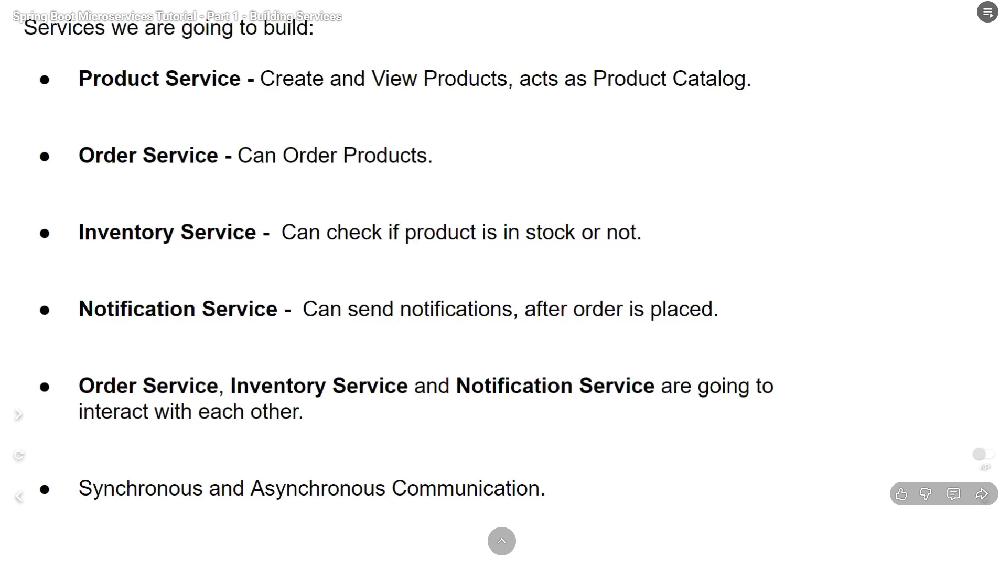
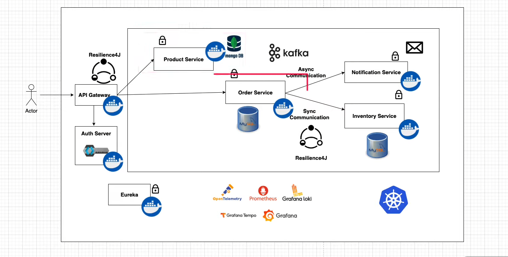
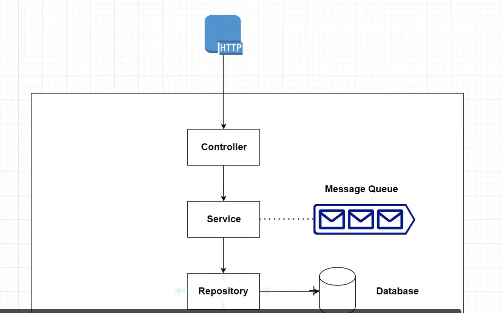
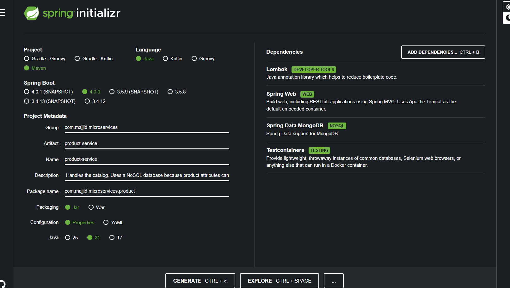

# SPRING_CommerceFlow-MS

⚠️ **Status**: Under Development

This repository is a learning project for Spring Boot microservices inspired by the "Spring Boot Microservices Tutorial" (Programming Techie). It contains the initial version of the Product Service and reference docs to build out the full microservices system (Order, Inventory, Notification, etc.).

---

## Project Overview

The SPRING_CommerceFlow-MS project demonstrates a microservices architecture using Spring Boot and Spring Cloud concepts. The project focuses on building small, single-responsibility services with their own data stores and provides best practices around composition, messaging, and observability.

Services target (planned):
- Product Service (implemented)
- Order Service (TBD)
- Inventory Service (TBD)
- Notification Service (TBD)

This repo is primarily a learning and teaching reference and is under active development.

---


## Document Reference

- **Author:** Ayoub Majjid
- **Date:** 24/11/2025
- **Version:** 1.0
- **Course Source:** [Spring Boot Microservices Tutorial Playlist](https://www.youtube.com/playlist?list=PLSVW22jAG8pDeU80nDzbUgr8qqzEMppi8)
- **Course Name:** Spring Boot Microservices Tutorial
- **Channel:** Programming Techie 

---

## Current State

**Current Video:** Spring Boot Microservices Tutorial - Part 5 - Spring Cloud Gateway MVC

**Link:** [Watch on YouTube](https://youtu.be/2AtL7qvTjOg?si=ZsVmG8oju9jJkPkQ)

---

# Part 1 - Building Services

## Introduction: The Microservices Paradigm

### What are Microservices?
Microservices is an architectural style that structures an application as a collection of small, autonomous services, modeled around a business domain. 
- **Monolith vs. Microservices**: Unlike a monolithic application where all functionality (UI, business logic, database access) is bundled into a single deployable unit, microservices split these concerns.
- **Why do we need them?**: 
    - **Scalability**: You can scale specific services (e.g., the Product Service) without scaling the entire application.
    - **Agility**: Different teams can work on different services simultaneously using different technologies.
    - **Resilience**: If one service fails, it doesn't necessarily bring down the whole system.

### The Spring Boot Ecosystem
Spring Boot is the de-facto standard for building microservices in Java. It simplifies the setup of production-grade applications.
- **Spring Cloud**: While Spring Boot builds the services, **Spring Cloud** provides the tools to make them work together (Service Discovery, Configuration, Circuit Breakers, Gateway).

## Services We Are Going to Build

- **Product Service**
- **Order Service**
- **Inventory Service**
- **Notification Service**




## Architecture Deep Dive



### 1. Infrastructure & Orchestration: The "Glue"
Before looking at the individual services, it's crucial to understand what holds them together.
- **Docker (Containerization)**: Each service (Product, Order, etc.) and tool (Prometheus, Grafana) is packaged into a **Docker Container**. This ensures that the application runs exactly the same on your laptop as it does on a server, bundling all dependencies (Java, libraries) together.
- **Kubernetes (Orchestration)**: This is the system that "gathers" all these components. It manages the containers, ensuring they are running, healthy, and can talk to each other. If a container crashes, Kubernetes restarts it. It acts as the operating system for your distributed application.

### 2. Component Roles & Responsibilities

#### A. The Gatekeepers (Edge Layer)
- **API Gateway**: The single entry point for all traffic. It hides the internal complexity of the system. Instead of a client calling `order-service:8081` and `product-service:8080`, they just call `api.myapp.com/order` and `api.myapp.com/product`.
- **Auth Server (Keycloak/OAuth2)**: Manages identity. It issues security tokens (JWTs) so that services know *who* is making the request and *what* they are allowed to do.

#### B. The Core Business Services
- **Product Service (MongoDB)**: Handles the catalog. Uses a NoSQL database because product attributes can vary wildly (flexible schema).
- **Order Service (MySQL)**: The central transaction handler. Uses a Relational Database (ACID compliance) because order data must be strictly consistent.
- **Inventory Service (MySQL)**: Manages stock. It is a critical dependency for the Order Service.
- **Notification Service**: A decoupled service responsible for sending emails/SMS. It doesn't need to respond immediately to the user.

#### C. The Supporting Cast (Infrastructure Services)
- **Eureka (Service Discovery)**: The "Phonebook". Services register here (e.g., "I am Order Service, IP: 10.0.0.5"). When the Gateway needs to route a request, it asks Eureka where the Order Service is.
- **Kafka (Message Broker)**: The "Post Office". Enables asynchronous communication. Services drop messages here and move on, without waiting for a receiver to pick them up.

### 3. Full Request Flow Example: "Placing an Order"
Let's trace a single user request to see how these components interact in real-time.

**Scenario**: A user clicks "Buy Now" on a generic iPhone 15.

1.  **Entry**: The request hits the **API Gateway**.
2.  **Security Check**: The Gateway checks the Authorization Header. If valid, it forwards the request to the **Order Service**.
3.  **Business Logic (Order Service)**:
    *   The Order Service receives the request.
    *   **Synchronous Call**: It *immediately* calls the **Inventory Service** (via HTTP) to ask: "Is iPhone 15 in stock?".
    *   *Wait...*: The Order Service waits for a Yes/No.
    *   If "Yes": The Order is saved to the MySQL database.
4.  **Async Notification**:
    *   The Order Service does *not* want to wait for an email to be sent (that takes too long).
    *   It sends a "OrderPlacedEvent" to **Kafka** and immediately returns "Order Successful" to the user.
5.  **Background Processing**:
    *   The **Notification Service** is listening to Kafka. It picks up the message and sends an email to the user.

### 4. Analyzing Insights (Observability)

How do we know all the steps happened correctly?

- **Distributed Tracing (Tempo/Zipkin)**: A unique "Trace ID" is attached to the request at the Gateway. This ID travels with the request to Order → Inventory → Kafka → Notification. We can view a timeline graph showing exactly how long each step took.
- **Metrics (Prometheus/Grafana)**: We can see graphs showing "Orders per second" or "Inventory Service Latency".
- **Logs (Loki)**: If the Inventory check failed, we can search the logs for that specific Trace ID and see the error message from the Inventory Service.


## Internal Service Architecture: The Layered Approach



Each microservice in our system follows a standard **Layered Architecture**. This separation of concerns ensures that the code is maintainable, testable, and easy to understand.

### 1. The Presentation Layer: Controller
*   **Role**: The "Front Desk". It is the entry point for HTTP requests (GET, POST, PUT, DELETE).
*   **Responsibilities**:
    *   **Handling Requests**: Maps URLs (e.g., `/api/product`) to Java methods.
    *   **Validation**: Checks if the incoming data is valid (e.g., "Price cannot be negative").
    *   **DTOs (Data Transfer Objects)**: Converts the raw JSON request into a Java object. It ensures we don't expose our internal database entities directly to the outside world.
*   **Interaction**: It passes the clean, validated data to the **Service Layer**. It *never* talks to the database directly.

### 2. The Business Logic Layer: Service
*   **Role**: The "Brain". This is where the actual work happens.
*   **Responsibilities**:
    *   **Business Rules**: Implements logic like "Check if user has enough credit" or "Calculate total price with tax".
    *   **Orchestration**: It coordinates between different components. It might call the Repository to save data, then call the Message Queue to send a notification.
    *   **Transactions**: Ensures that a series of operations either all succeed or all fail (Atomic).
*   **Interaction**: 
    *   Calls the **Repository** to fetch/save data.
    *   Sends messages to the **Message Queue** (Producer).

### 3. The Data Access Layer: Repository
*   **Role**: The "Librarian". It abstracts the underlying database technology.
*   **Responsibilities**:
    *   **CRUD Operations**: Provides methods to Create, Read, Update, and Delete records.
    *   **Query Abstraction**: In Spring Data, we can simply define an interface (e.g., `findBySkuCode`), and Spring automatically generates the SQL query for us.
*   **Interaction**: Talks directly to the **Database** (MySQL/MongoDB).

### 4. External Dependencies (Outside the Service)
These components live outside the application code but are critical for its operation.

*   **Database (Data Storage)**:
    *   Stores the persistent state of the service.
    *   *Example*: The Product Service stores product details in MongoDB; the Order Service stores orders in MySQL.
    *   **Isolation**: Each service owns its own database. The Order Service cannot read the Product Service's database directly; it must ask the Product Service via API.

*   **Message Queue (Asynchronous Communication)**:
    *   Acts as a buffer and distributor for messages.
    *   *Example*: When an order is placed, the Order Service drops a message here. The Notification Service picks it up later. This ensures that if the Notification Service is down, the Order Service doesn't crash—the message just waits in the queue.


## Step-by-Step: Setting up the Product Service



To bootstrap our **Product Service**, we use **Spring Initializr** (start.spring.io). This tool generates a production-ready project structure with all the necessary build configurations.

### 1. Project Metadata
*   **Project**: Maven (Dependency Management tool)
*   **Language**: Java
*   **Spring Boot**: 3.x.x (Latest stable version)
*   **Group**: `com.majjid.microservices` (Your organization ID)
*   **Artifact**: `product-service` (The name of the jar file)

### 2. Key Dependencies & Why We Need Them

We selected four specific dependencies. Here is the reasoning for each:

*   **Spring Web**:
    *   **Why?**: This is the core dependency for building RESTful APIs.
    *   **What it does**: It includes **Tomcat** (an embedded web server) so we can run our app as a standalone JAR. It also provides the annotations we need like `@RestController`, `@GetMapping`, and `@PostMapping` to define our API endpoints.

*   **Spring Data MongoDB**:
    *   **Why?**: The Product Service needs to store product data (Name, Description, Price). We chose MongoDB (NoSQL) because product data can be unstructured or variable.
    *   **What it does**: It provides the `MongoRepository` interface, allowing us to interact with the database using simple Java methods (e.g., `repository.save(product)`) instead of writing raw database queries.

*   **Lombok**:
    *   **Why?**: Java can be verbose. We don't want to write hundreds of lines of Getters, Setters, and Constructors.
    *   **What it does**: It's a library that automatically plugs into your editor and build tool. By adding annotations like `@Data`, `@AllArgsConstructor`, and `@Builder` to our classes, Lombok generates all that boilerplate code for us at compile time.

*   **Testcontainers**:
    *   **Why?**: For reliable integration testing.
    *   **What it does**: It allows us to spin up a real MongoDB instance inside a Docker container during our tests. This ensures that our tests run against a real database environment rather than an in-memory mock, preventing "it works on my machine" issues.
    - 


## Docker Compose Configuration for Product Service 

```yaml
services:
  mongodb:
    image: mongo:latest
    container_name: mongodb
    ports:
      - "27017:27017"
    environment:
      # Still create a root user for administrative tasks
      - MONGO_INITDB_ROOT_USERNAME=root # Admin user
      - MONGO_INITDB_ROOT_PASSWORD=supersecretpassword # Use a strong password
      # Create a dedicated user for the application
      - MONGO_INITDB_DATABASE=product-service # The database for the new user
      - MONGO_INITDB_USERNAME=product-user # Application-specific user
      - MONGO_INITDB_PASSWORD=apppassword # Application-specific password
    volumes:
      - mongodb_data:/data/db

#  product-service:
#    build: .
#    image: product-service
#    container_name: product-service
#    ports:
#      - 8080:8080
#
volumes:
  mongodb_data:

```


# 🧪 Microservices Testing Strategy Report

## 1. Unit Testing (Mockito)

**"Testing the Engine Parts in Isolation"**

**Concept:**
Unit testing focuses on testing a single class (usually the Service layer) in complete isolation. It does **not** load the Spring context, does not connect to a database, and does not handle HTTP requests.

**Tool:** `Mockito`
Mockito is a mocking framework that allows you to create "fake" versions of dependencies. For example, if testing `InventoryService`, you don't rely on a real `InventoryRepository`. You "mock" the repository to return exactly what you want.

**Key Characteristics:**

* **Speed:** Extremely fast (milliseconds)
* **Isolation:** No side effects (DB is not touched)
* **Control:** Easily simulate edge cases (e.g., database exceptions)

**Code Example:** Testing `getInventoryBySkuCode` in `InventoryService`

```java
@ExtendWith(MockitoExtension.class) // Enable Mockito
class InventoryServiceTest {

    @Mock
    private InventoryRepository inventoryRepository; // Fake Repo

    @InjectMocks
    private InventoryService inventoryService; // Inject fake Repo into real Service

    @Test
    void shouldReturnInventory() {
        // Arrange
        String sku = "IPHONE_13";
        Inventory mockInventory = new Inventory(1L, sku, 100);
      
        // Teach the mock how to behave
        when(inventoryRepository.findBySkuCode(sku)).thenReturn(Optional.of(mockInventory));

        // Act
        ResponseDto<InventoryResponseDto> response = inventoryService.getInventoryBySkuCode(sku);

        // Assert
        assertEquals(100, response.getData().quantity());
    }
}
```

---

## 2. Integration Testing (MockMvc)

**"Testing the Wiring without the Network"**

**Concept:**
Tests the integration between Controller, Service, and Repository layers. Loads Spring Application Context but does not start a real HTTP server. Simulates HTTP requests internally.

**Tool:** `MockMvc`
Allows sending fake HTTP requests to controllers and asserting results (status code, JSON body).

**Key Characteristics:**

* **Speed:** Slower than unit tests but faster than RestAssured
* **Scope:** Tests validation (`@Valid`), serialization (JSON ↔ Object), and HTTP status codes
* **Context:** Requires `@SpringBootTest` or `@WebMvcTest`

**Code Example:** Testing `POST /api/inventory`

```java
@SpringBootTest
@AutoConfigureMockMvc // Configure fake server
class InventoryMockMvcTest {

    @Autowired
    private MockMvc mockMvc;

    @Test
    void shouldCreateInventory() throws Exception {
        String jsonRequest = "{\"skuCode\": \"IPHONE_13\", \"quantity\": 100}";

        mockMvc.perform(post("/api/inventory")
                .contentType(MediaType.APPLICATION_JSON)
                .content(jsonRequest))
                .andDo(print()) // Log details
                .andExpect(status().isCreated())
                .andExpect(jsonPath("$.data.skuCode").value("IPHONE_13"));
    }
}
```

---

## 3. End-to-End / Full Integration (RestAssured)

**"Testing the Running Application"**

**Concept:**
Tests the application exactly as a user or another microservice would see it. Starts a real web server and sends real HTTP requests over the network.

**Tool:** `RestAssured`
Simplifies testing REST APIs using a BDD syntax: `Given() -> When() -> Then()`.

**Key Characteristics:**

* **Realism:** Catches issues with server configuration, filters, and network serialization
* **Speed:** Slower than MockMvc
* **Database:** Often combined with Testcontainers for a real Docker DB

**Code Example:** Full flow of creating and retrieving an item

```java
@SpringBootTest(webEnvironment = SpringBootTest.WebEnvironment.RANDOM_PORT)
class InventoryRestAssuredTest {

    @LocalServerPort
    private int port;

    @BeforeEach
    void setup() {
        RestAssured.port = port;
    }

    @Test
    void shouldCreateAndGetInventory() {
        String jsonRequest = "{\"skuCode\": \"IPHONE_13\", \"quantity\": 100}";

        RestAssured.given()
                .contentType(ContentType.JSON)
                .body(jsonRequest)
        .when()
                .post("/api/inventory")
        .then()
                .statusCode(201)
                .body("data.skuCode", equalTo("IPHONE_13"));
    }
}
```

---

## 4. External Service Mocking (WireMock)

**"Faking the Neighbors"**

**Concept:**
In microservices, a service might call other services (e.g., NotificationService). Instead of starting those services in tests, you mock the external API.

**Tool:** `WireMock`
Spins up a small web server that acts as a "stand-in" for external APIs. You can simulate responses, errors, or timeouts.

**Key Characteristics:**

* **Decoupling:** Test service independently from external dependencies
* **Reliability:** Simulate network timeouts or 500 errors

**Code Example:** Mocking NotificationService

```java
@SpringBootTest
@AutoConfigureWireMock(port = 0)
class InventoryExternalTest {

    @Test
    void shouldNotifyUser() {
        // Stub external API
        stubFor(post(urlEqualTo("/send"))
                .willReturn(aResponse()
                        .withStatus(200)
                        .withBody("Notification Sent!")));

        // Call service (internally calls external API)
        inventoryService.purchaseInventory("IPHONE_13", new PurchaseDto(1));

        // Verify service called external API
        verify(postRequestedFor(urlEqualTo("/send")));
    }
}
```

---

## Summary Comparison Table

| Feature            | Unit Test (Mockito)    | Integration (MockMvc)     | E2E (RestAssured)  | External Mock (WireMock)   |
| ------------------ | ---------------------- | ------------------------- | ------------------ | -------------------------- |
| **Target**   | Single Class (Service) | Controller + Service + DB | Full Running App   | External APIs              |
| **Speed**    | ⚡ Very Fast           | 🚀 Fast                   | 🐢 Slow            | 🚀 Fast                    |
| **Network**  | None                   | Simulated (Mock)          | Real (HTTP)        | Real (HTTP to Mock Server) |
| **Database** | Mocked (No DB)         | Real (H2 or Docker)       | Real (Docker)      | N/A                        |
| **Best For** | Complex Business Logic | Validation, JSON format   | Final Verification | Testing dependencies       |

# 🏗️ Modern Testing Structure for a Spring Boot Product Management System

When building a modern Spring Boot application (e.g., **Product Management System**), the testing strategy should cover **all layers**: unit tests, integration tests, E2E tests, external dependencies, and automation via CI/CD.

---

## 1. Unit Testing: Core Business Logic

**Purpose:**
Test each service or component in **complete isolation**.

**Structure:**

* `src/test/java/com/example/product/service/ProductServiceTest.java`
* Each service should have its own test class.
* Use **Mockito** to mock repositories and external dependencies.

**Best Practices:**

* Test happy paths and edge cases.
* Mock external API calls and DB repositories.
* Focus on **pure logic** without starting Spring Context.

**Example:**

```java
@ExtendWith(MockitoExtension.class)
class ProductServiceTest {

    @Mock
    private ProductRepository productRepository;

    @InjectMocks
    private ProductService productService;

    @Test
    void shouldReturnProductById() {
        Product product = new Product(1L, "Laptop", 1200);
        when(productRepository.findById(1L)).thenReturn(Optional.of(product));

        Product result = productService.getProductById(1L);

        assertEquals("Laptop", result.getName());
    }
}
```

---

## 2. Integration Testing: Controller + Service + DB

**Purpose:**
Test how controllers, services, and repositories work together.

**Structure:**

* `src/test/java/com/example/product/controller/ProductControllerTest.java`
* Use `@SpringBootTest` + `@AutoConfigureMockMvc`
* Use **H2 in-memory database** or **Testcontainers** for realistic DB behavior.

**Best Practices:**

* Test HTTP endpoints (`GET`, `POST`, `PUT`, `DELETE`).
* Validate input and output (`@Valid`, JSON serialization).
* Keep the tests isolated by resetting DB before each test (`@Transactional` or DB cleanup scripts).

**Example:**

```java
@SpringBootTest
@AutoConfigureMockMvc
class ProductControllerTest {

    @Autowired
    private MockMvc mockMvc;

    @Test
    void shouldCreateProduct() throws Exception {
        String jsonRequest = "{\"name\": \"Laptop\", \"price\": 1200}";

        mockMvc.perform(post("/api/products")
                .contentType(MediaType.APPLICATION_JSON)
                .content(jsonRequest))
                .andExpect(status().isCreated())
                .andExpect(jsonPath("$.name").value("Laptop"));
    }
}
```

---

## 3. End-to-End (E2E) Testing: Full Application

**Purpose:**
Test the application exactly as users or other services will interact.

**Structure:**

* `src/test/java/com/example/product/e2e/ProductE2ETest.java`
* Use **RestAssured** to send real HTTP requests to a **running server** (random port).
* Combine with **Testcontainers** for DB and message brokers.

**Best Practices:**

* Test **full workflows**, e.g., create product → update product → delete product.
* Validate **security, authentication, and authorization**.
* Ensure tests run in **isolated environments** (Docker or CI pipeline).

**Example:**

```java
@SpringBootTest(webEnvironment = SpringBootTest.WebEnvironment.RANDOM_PORT)
class ProductE2ETest {

    @LocalServerPort
    private int port;

    @BeforeEach
    void setup() {
        RestAssured.port = port;
    }

    @Test
    void shouldCreateAndRetrieveProduct() {
        String jsonRequest = "{\"name\": \"Laptop\", \"price\": 1200}";

        RestAssured.given()
                .contentType(ContentType.JSON)
                .body(jsonRequest)
        .when()
                .post("/api/products")
        .then()
                .statusCode(201)
                .body("name", equalTo("Laptop"));

        RestAssured.get("/api/products/1")
                .then()
                .statusCode(200)
                .body("price", equalTo(1200));
    }
}
```

---

## 4. Mocking External Services

**Purpose:**
Simulate external APIs that your microservice depends on (e.g., payment gateway, notification service).

**Tool:** `WireMock` or `MockServer`

**Best Practices:**

* Test failure scenarios (timeouts, 500 errors).
* Use in integration/E2E tests to avoid calling real services.

---

## 5. CI/CD Integration

**Purpose:**
Automate testing, code quality checks, and deployments.

**Modern CI/CD Flow:**

1. **Build Stage:**

   * Compile the Spring Boot project
   * Run **Unit Tests** (`mvn test` or `gradle test`)
2. **Integration Test Stage:**

   * Run tests using **H2/Testcontainers**
   * Ensure DB schema migrations applied (`Flyway` or `Liquibase`)
3. **E2E Test Stage:**

   * Deploy application in a **Docker container**
   * Run **RestAssured E2E tests**
   * Mock external services with **WireMock/Testcontainers**
4. **Code Quality & Coverage:**

   * Use **SonarQube** or **Jacoco** to enforce coverage and quality gates
5. **Deployment:**

   * Automatic deployment to staging if all tests pass
   * Optional manual or automatic promotion to production

**CI/CD Tools Examples:**

* GitHub Actions
* GitLab CI
* Jenkins
* Bitbucket Pipelines

**Example GitHub Actions Workflow (simplified):**

```yaml
name: CI
on: [push, pull_request]
jobs:
  build-and-test:
    runs-on: ubuntu-latest
    steps:
      - uses: actions/checkout@v3
      - name: Set up JDK 17
        uses: actions/setup-java@v3
        with:
          java-version: 17
      - name: Build and run tests
        run: ./mvnw clean verify
      - name: Run E2E Tests
        run: ./mvnw verify -P e2e
```

---

## ✅ Summary of Modern Testing Approach

| Layer         | Tool                    | Purpose                        | Notes                                             |
| ------------- | ----------------------- | ------------------------------ | ------------------------------------------------- |
| Unit          | Mockito                 | Test individual services       | Fast, isolated, DB not required                   |
| Integration   | MockMvc                 | Test controller + service + DB | Validate HTTP + JSON + DB                         |
| E2E           | RestAssured             | Full application workflows     | Real server, Docker DB                            |
| External Mock | WireMock                | Mock external APIs             | Decouples dependencies                            |
| CI/CD         | GitHub Actions, Jenkins | Automate build & tests         | Integrates all testing layers, deploys on success |

**Tips for Product Management System:**

* Start with unit tests for services like ProductService, InventoryService.
* Gradually add integration tests for REST endpoints.
* Use E2E for critical workflows (product creation, update, purchase).
* Always mock third-party dependencies.
* Automate everything in CI/CD to catch errors early.


## License

This repository is provided for learning and demonstration purposes. No license specified — please contact the repository owner for usage permissions.
