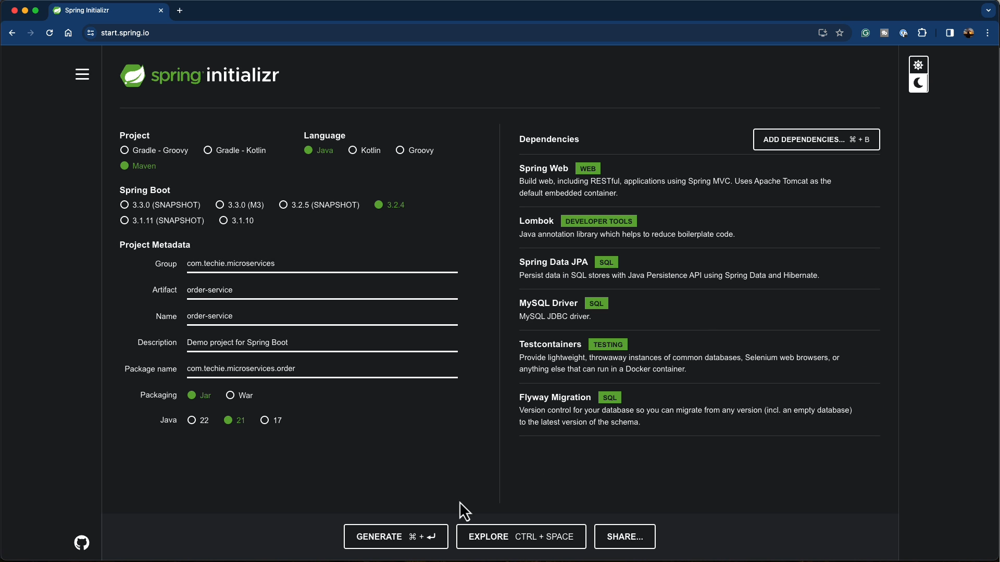

# Project setup



## Why add the Flyway dependency?

Adding the Flyway dependency enables automated, versioned database migrations for the service. Flyway runs migration scripts at application startup so the database schema stays consistent across development, testing, and production environments — preventing schema drift and making it safer and simpler to deploy schema changes.

## Quick guide — getting Flyway running

By default Flyway looks for migration scripts on the classpath at `src/main/resources/db/migration`. If you see a "No migrations found" warning it means that folder exists (or not) but contains no files using Flyway's required naming pattern.

Follow these steps to add a first migration:

1. Create the directory

    - In your project create: `src/main/resources/db/migration`

2. Create the migration file

    - Add a SQL file named using the pattern: `V<VERSION>__<DESCRIPTION>.sql` (for example `V1__create_t_orders_table.sql`).

3. Add SQL to the file

    - Example `V1__create_t_orders_table.sql`:

```sql
CREATE TABLE t_orders (
     id INT AUTO_INCREMENT PRIMARY KEY,
     order_number VARCHAR(255),
     sku_code VARCHAR(255),
     order_status VARCHAR(255),
     price DECIMAL(19, 2),
     quantity INT
);
```

4. Update `application.properties` (recommended)

    - When using Flyway to manage schema, set Hibernate to `validate` so it only checks the schema instead of modifying it:

```properties
spring.jpa.hibernate.ddl-auto=validate
```

After adding the migration file, restart the application — Flyway will detect and run the script, creating the `t_orders` table and removing the "No migrations found" warning.

## Run MySQL with Docker Compose (local dev)

You can run a local MySQL instance for the Order Service using Docker Compose. Create a `docker-compose.yml` file next to the project root (or in a `docker/` folder) with the following content:

```yaml
version: '3.8'
services:
    mysql:
        image: mysql:8.3.0
        container_name: mysql_order_service
        environment:
            MYSQL_ROOT_PASSWORD: mysql
            MYSQL_DATABASE: order_service
        ports:
            - "3306:3306"
        volumes:
            - ./mysql_data:/var/lib/mysql
            - ./docker/mysql/init.sql:/docker-entrypoint-initdb.d/init.sql

volumes:
    mysql_data:
```

The included `init.sql` will run automatically the first time the container initializes. Example `init.sql` (place it at `docker/mysql/init.sql` relative to the compose file):

```sql
CREATE DATABASE IF NOT EXISTS order_service;
```

Notes:

- The `MYSQL_DATABASE` environment variable creates the `order_service` database at container startup. The `init.sql` can contain additional seed data or schema setup if you prefer.
- The mapped volume `./mysql_data` persists database files on the host so data survives container restarts.
- If you use Flyway in the application, place your migration SQL files under `src/main/resources/db/migration` in the project — Flyway will run them on application startup and manage schema versions.

To start the database:

```bash
docker-compose up -d
```

To stop and remove containers and volumes (use with care):

```bash
docker-compose down -v
```


