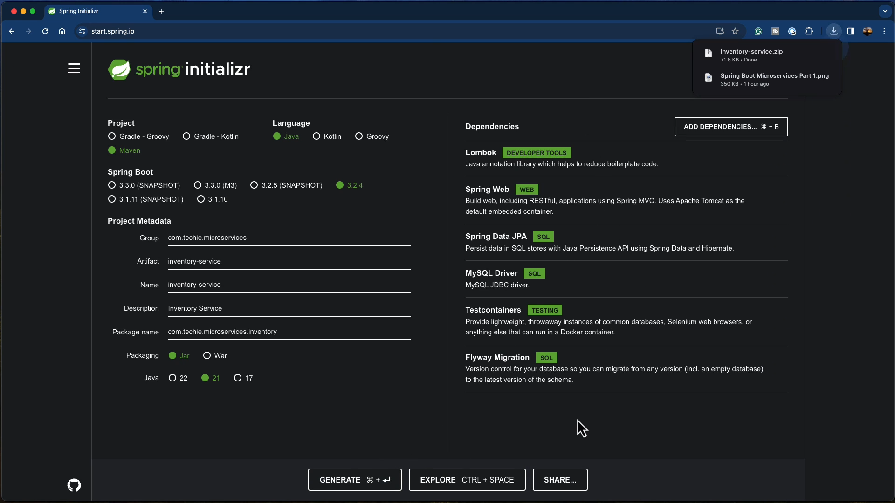
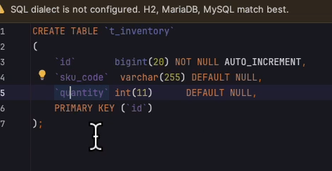
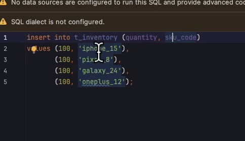
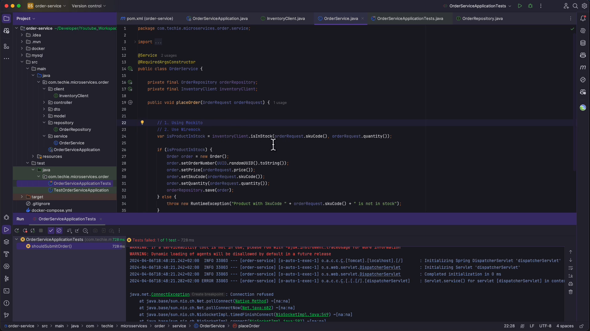

# Setup :



# flyway migration script :

<!-- V1__init.sql -->



<!-- V2__add_inventory.sql -->






---

# 🧪 Microservices Testing Strategy Report

## 1. Unit Testing (Mockito)

**"Testing the Engine Parts in Isolation"**

**Concept:**
Unit testing focuses on testing a single class (usually the Service layer) in complete isolation. It does **not** load the Spring context, does not connect to a database, and does not handle HTTP requests.

**Tool:** `Mockito`
Mockito is a mocking framework that allows you to create "fake" versions of dependencies. For example, if testing `InventoryService`, you don't rely on a real `InventoryRepository`. You "mock" the repository to return exactly what you want.

**Key Characteristics:**

* **Speed:** Extremely fast (milliseconds)
* **Isolation:** No side effects (DB is not touched)
* **Control:** Easily simulate edge cases (e.g., database exceptions)

**Code Example:** Testing `getInventoryBySkuCode` in `InventoryService`

```java
@ExtendWith(MockitoExtension.class) // Enable Mockito
class InventoryServiceTest {

    @Mock
    private InventoryRepository inventoryRepository; // Fake Repo

    @InjectMocks
    private InventoryService inventoryService; // Inject fake Repo into real Service

    @Test
    void shouldReturnInventory() {
        // Arrange
        String sku = "IPHONE_13";
        Inventory mockInventory = new Inventory(1L, sku, 100);
      
        // Teach the mock how to behave
        when(inventoryRepository.findBySkuCode(sku)).thenReturn(Optional.of(mockInventory));

        // Act
        ResponseDto<InventoryResponseDto> response = inventoryService.getInventoryBySkuCode(sku);

        // Assert
        assertEquals(100, response.getData().quantity());
    }
}
```

---

## 2. Integration Testing (MockMvc)

**"Testing the Wiring without the Network"**

**Concept:**
Tests the integration between Controller, Service, and Repository layers. Loads Spring Application Context but does not start a real HTTP server. Simulates HTTP requests internally.

**Tool:** `MockMvc`
Allows sending fake HTTP requests to controllers and asserting results (status code, JSON body).

**Key Characteristics:**

* **Speed:** Slower than unit tests but faster than RestAssured
* **Scope:** Tests validation (`@Valid`), serialization (JSON ↔ Object), and HTTP status codes
* **Context:** Requires `@SpringBootTest` or `@WebMvcTest`

**Code Example:** Testing `POST /api/inventory`

```java
@SpringBootTest
@AutoConfigureMockMvc // Configure fake server
class InventoryMockMvcTest {

    @Autowired
    private MockMvc mockMvc;

    @Test
    void shouldCreateInventory() throws Exception {
        String jsonRequest = "{\"skuCode\": \"IPHONE_13\", \"quantity\": 100}";

        mockMvc.perform(post("/api/inventory")
                .contentType(MediaType.APPLICATION_JSON)
                .content(jsonRequest))
                .andDo(print()) // Log details
                .andExpect(status().isCreated())
                .andExpect(jsonPath("$.data.skuCode").value("IPHONE_13"));
    }
}
```

---

## 3. End-to-End / Full Integration (RestAssured)

**"Testing the Running Application"**

**Concept:**
Tests the application exactly as a user or another microservice would see it. Starts a real web server and sends real HTTP requests over the network.

**Tool:** `RestAssured`
Simplifies testing REST APIs using a BDD syntax: `Given() -> When() -> Then()`.

**Key Characteristics:**

* **Realism:** Catches issues with server configuration, filters, and network serialization
* **Speed:** Slower than MockMvc
* **Database:** Often combined with Testcontainers for a real Docker DB

**Code Example:** Full flow of creating and retrieving an item

```java
@SpringBootTest(webEnvironment = SpringBootTest.WebEnvironment.RANDOM_PORT)
class InventoryRestAssuredTest {

    @LocalServerPort
    private int port;

    @BeforeEach
    void setup() {
        RestAssured.port = port;
    }

    @Test
    void shouldCreateAndGetInventory() {
        String jsonRequest = "{\"skuCode\": \"IPHONE_13\", \"quantity\": 100}";

        RestAssured.given()
                .contentType(ContentType.JSON)
                .body(jsonRequest)
        .when()
                .post("/api/inventory")
        .then()
                .statusCode(201)
                .body("data.skuCode", equalTo("IPHONE_13"));
    }
}
```

---

## 4. External Service Mocking (WireMock)

**"Faking the Neighbors"**

**Concept:**
In microservices, a service might call other services (e.g., NotificationService). Instead of starting those services in tests, you mock the external API.

**Tool:** `WireMock`
Spins up a small web server that acts as a "stand-in" for external APIs. You can simulate responses, errors, or timeouts.

**Key Characteristics:**

* **Decoupling:** Test service independently from external dependencies
* **Reliability:** Simulate network timeouts or 500 errors

**Code Example:** Mocking NotificationService

```java
@SpringBootTest
@AutoConfigureWireMock(port = 0)
class InventoryExternalTest {

    @Test
    void shouldNotifyUser() {
        // Stub external API
        stubFor(post(urlEqualTo("/send"))
                .willReturn(aResponse()
                        .withStatus(200)
                        .withBody("Notification Sent!")));

        // Call service (internally calls external API)
        inventoryService.purchaseInventory("IPHONE_13", new PurchaseDto(1));

        // Verify service called external API
        verify(postRequestedFor(urlEqualTo("/send")));
    }
}
```

---

## Summary Comparison Table

| Feature            | Unit Test (Mockito)    | Integration (MockMvc)     | E2E (RestAssured)  | External Mock (WireMock)   |
| ------------------ | ---------------------- | ------------------------- | ------------------ | -------------------------- |
| **Target**   | Single Class (Service) | Controller + Service + DB | Full Running App   | External APIs              |
| **Speed**    | ⚡ Very Fast           | 🚀 Fast                   | 🐢 Slow            | 🚀 Fast                    |
| **Network**  | None                   | Simulated (Mock)          | Real (HTTP)        | Real (HTTP to Mock Server) |
| **Database** | Mocked (No DB)         | Real (H2 or Docker)       | Real (Docker)      | N/A                        |
| **Best For** | Complex Business Logic | Validation, JSON format   | Final Verification | Testing dependencies       |

# 🏗️ Modern Testing Structure for a Spring Boot Product Management System

When building a modern Spring Boot application (e.g., **Product Management System**), the testing strategy should cover **all layers**: unit tests, integration tests, E2E tests, external dependencies, and automation via CI/CD.

---

## 1. Unit Testing: Core Business Logic

**Purpose:**
Test each service or component in **complete isolation**.

**Structure:**

* `src/test/java/com/example/product/service/ProductServiceTest.java`
* Each service should have its own test class.
* Use **Mockito** to mock repositories and external dependencies.

**Best Practices:**

* Test happy paths and edge cases.
* Mock external API calls and DB repositories.
* Focus on **pure logic** without starting Spring Context.

**Example:**

```java
@ExtendWith(MockitoExtension.class)
class ProductServiceTest {

    @Mock
    private ProductRepository productRepository;

    @InjectMocks
    private ProductService productService;

    @Test
    void shouldReturnProductById() {
        Product product = new Product(1L, "Laptop", 1200);
        when(productRepository.findById(1L)).thenReturn(Optional.of(product));

        Product result = productService.getProductById(1L);

        assertEquals("Laptop", result.getName());
    }
}
```

---

## 2. Integration Testing: Controller + Service + DB

**Purpose:**
Test how controllers, services, and repositories work together.

**Structure:**

* `src/test/java/com/example/product/controller/ProductControllerTest.java`
* Use `@SpringBootTest` + `@AutoConfigureMockMvc`
* Use **H2 in-memory database** or **Testcontainers** for realistic DB behavior.

**Best Practices:**

* Test HTTP endpoints (`GET`, `POST`, `PUT`, `DELETE`).
* Validate input and output (`@Valid`, JSON serialization).
* Keep the tests isolated by resetting DB before each test (`@Transactional` or DB cleanup scripts).

**Example:**

```java
@SpringBootTest
@AutoConfigureMockMvc
class ProductControllerTest {

    @Autowired
    private MockMvc mockMvc;

    @Test
    void shouldCreateProduct() throws Exception {
        String jsonRequest = "{\"name\": \"Laptop\", \"price\": 1200}";

        mockMvc.perform(post("/api/products")
                .contentType(MediaType.APPLICATION_JSON)
                .content(jsonRequest))
                .andExpect(status().isCreated())
                .andExpect(jsonPath("$.name").value("Laptop"));
    }
}
```

---

## 3. End-to-End (E2E) Testing: Full Application

**Purpose:**
Test the application exactly as users or other services will interact.

**Structure:**

* `src/test/java/com/example/product/e2e/ProductE2ETest.java`
* Use **RestAssured** to send real HTTP requests to a **running server** (random port).
* Combine with **Testcontainers** for DB and message brokers.

**Best Practices:**

* Test **full workflows**, e.g., create product → update product → delete product.
* Validate **security, authentication, and authorization**.
* Ensure tests run in **isolated environments** (Docker or CI pipeline).

**Example:**

```java
@SpringBootTest(webEnvironment = SpringBootTest.WebEnvironment.RANDOM_PORT)
class ProductE2ETest {

    @LocalServerPort
    private int port;

    @BeforeEach
    void setup() {
        RestAssured.port = port;
    }

    @Test
    void shouldCreateAndRetrieveProduct() {
        String jsonRequest = "{\"name\": \"Laptop\", \"price\": 1200}";

        RestAssured.given()
                .contentType(ContentType.JSON)
                .body(jsonRequest)
        .when()
                .post("/api/products")
        .then()
                .statusCode(201)
                .body("name", equalTo("Laptop"));

        RestAssured.get("/api/products/1")
                .then()
                .statusCode(200)
                .body("price", equalTo(1200));
    }
}
```

---

## 4. Mocking External Services

**Purpose:**
Simulate external APIs that your microservice depends on (e.g., payment gateway, notification service).

**Tool:** `WireMock` or `MockServer`

**Best Practices:**

* Test failure scenarios (timeouts, 500 errors).
* Use in integration/E2E tests to avoid calling real services.

---

## 5. CI/CD Integration

**Purpose:**
Automate testing, code quality checks, and deployments.

**Modern CI/CD Flow:**

1. **Build Stage:**

   * Compile the Spring Boot project
   * Run **Unit Tests** (`mvn test` or `gradle test`)
2. **Integration Test Stage:**

   * Run tests using **H2/Testcontainers**
   * Ensure DB schema migrations applied (`Flyway` or `Liquibase`)
3. **E2E Test Stage:**

   * Deploy application in a **Docker container**
   * Run **RestAssured E2E tests**
   * Mock external services with **WireMock/Testcontainers**
4. **Code Quality & Coverage:**

   * Use **SonarQube** or **Jacoco** to enforce coverage and quality gates
5. **Deployment:**

   * Automatic deployment to staging if all tests pass
   * Optional manual or automatic promotion to production

**CI/CD Tools Examples:**

* GitHub Actions
* GitLab CI
* Jenkins
* Bitbucket Pipelines

**Example GitHub Actions Workflow (simplified):**

```yaml
name: CI
on: [push, pull_request]
jobs:
  build-and-test:
    runs-on: ubuntu-latest
    steps:
      - uses: actions/checkout@v3
      - name: Set up JDK 17
        uses: actions/setup-java@v3
        with:
          java-version: 17
      - name: Build and run tests
        run: ./mvnw clean verify
      - name: Run E2E Tests
        run: ./mvnw verify -P e2e
```

---

## ✅ Summary of Modern Testing Approach

| Layer         | Tool                    | Purpose                        | Notes                                             |
| ------------- | ----------------------- | ------------------------------ | ------------------------------------------------- |
| Unit          | Mockito                 | Test individual services       | Fast, isolated, DB not required                   |
| Integration   | MockMvc                 | Test controller + service + DB | Validate HTTP + JSON + DB                         |
| E2E           | RestAssured             | Full application workflows     | Real server, Docker DB                            |
| External Mock | WireMock                | Mock external APIs             | Decouples dependencies                            |
| CI/CD         | GitHub Actions, Jenkins | Automate build & tests         | Integrates all testing layers, deploys on success |

**Tips for Product Management System:**

* Start with unit tests for services like ProductService, InventoryService.
* Gradually add integration tests for REST endpoints.
* Use E2E for critical workflows (product creation, update, purchase).
* Always mock third-party dependencies.
* Automate everything in CI/CD to catch errors early.


💡 **Rule of thumb for stock/inventory:**

* **409 CONFLICT** → when the requested quantity cannot be fulfilled due to  **current stock levels** .
* **422 UNPROCESSABLE_ENTITY** → when the request  **violates a business rule** , like ordering negative quantity or invalid SKU.
