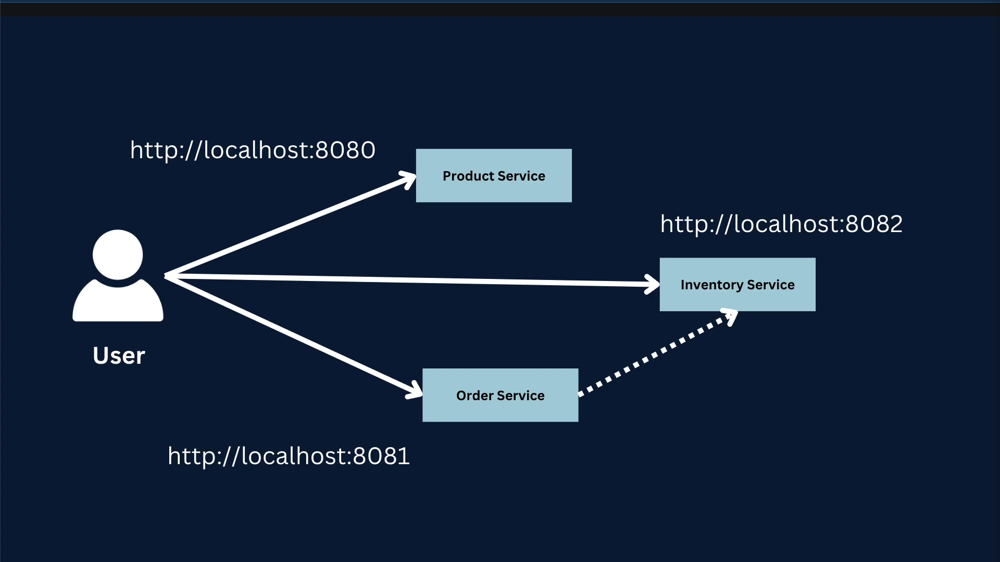
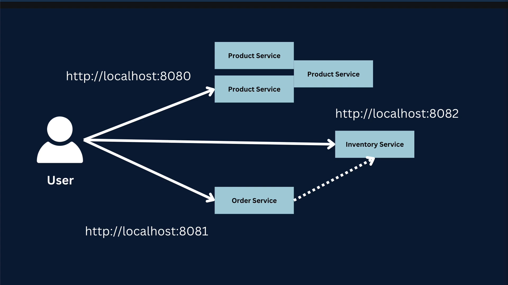
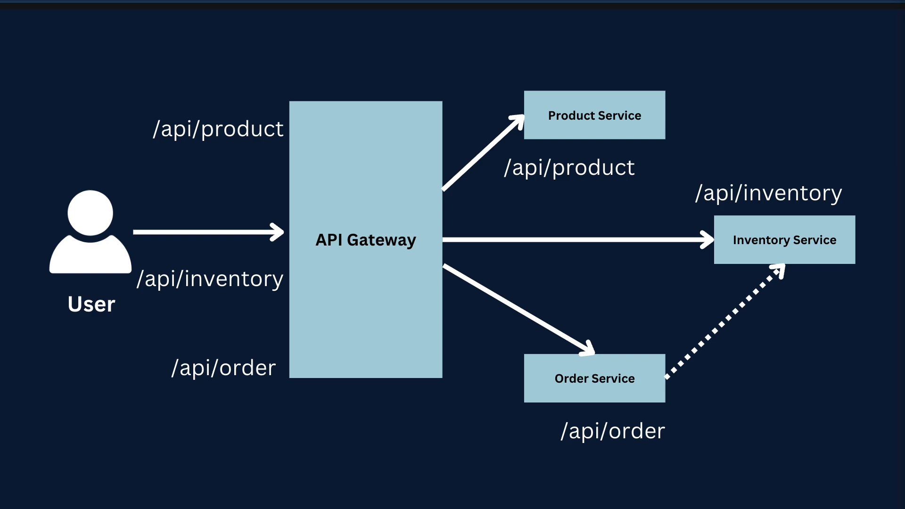
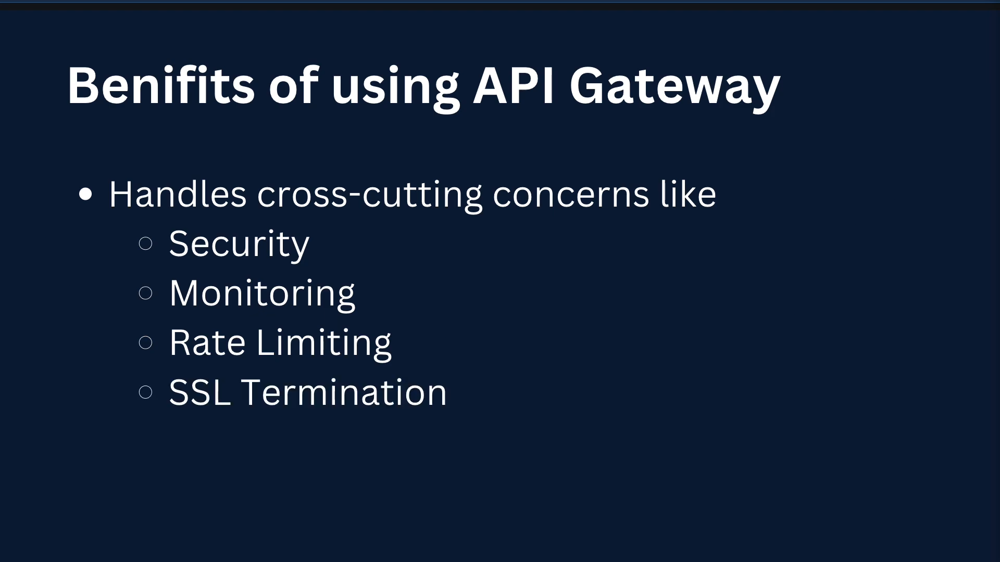
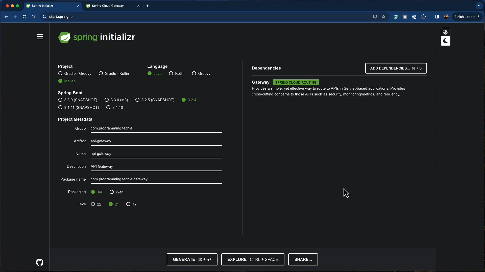

# Spring Cloud Gateway MVC - Part 5

## Table of Contents

1. [Introduction to API Gateway](#introduction-to-api-gateway)
2. [The Problem: Multiple Service Instances](#the-problem-multiple-service-instances)
3. [The Solution: API Gateway Pattern](#the-solution-api-gateway-pattern)
4. [Benefits of Using API Gateway](#benefits-of-using-api-gateway)
5. [Drawbacks of Using API Gateway](#drawbacks-of-using-api-gateway)
6. [Gateway Service Setup](#gateway-service-setup)

---

## Introduction to API Gateway



An **API Gateway** is a server that acts as a single entry point for all client requests in a microservices architecture. It sits between the client and the backend services, routing requests to the appropriate microservice.

---

## The Problem: Multiple Service Instances



### Challenges Without API Gateway

In a microservices architecture, you often have:
- **Multiple instances** of the same service running for high availability
- **Different services** running on different ports and hosts
- **Complex client-side logic** to manage service discovery
- **No centralized control** over cross-cutting concerns

**Example Problem:**
```
Client needs to know:
- Product Service: http://localhost:8080
- Order Service: http://localhost:8081
- Inventory Service: http://localhost:8082

What if services scale to multiple instances?
- Product Service: Instance 1, Instance 2, Instance 3...
- Order Service: Instance 1, Instance 2...
```

The client would need to:
1. Know all service addresses
2. Implement load balancing logic
3. Handle service discovery
4. Manage authentication for each service

---

## The Solution: API Gateway Pattern



### How API Gateway Solves the Problem

The API Gateway provides a **single entry point** for all client requests:

```
Client → API Gateway → [Product Service | Order Service | Inventory Service]
```

**Key Features:**
- ✅ **Single endpoint** for clients (`http://api-gateway:8080`)
- ✅ **Automatic routing** to backend services
- ✅ **Load balancing** across service instances
- ✅ **Service discovery** integration
- ✅ **Centralized configuration** for cross-cutting concerns

---

## Benefits of Using API Gateway



### Cross-Cutting Concerns

The API Gateway handles common concerns that would otherwise need to be implemented in each service:

#### 1. **Security** 🔒
- Centralized authentication and authorization
- Token validation (JWT, OAuth2)
- API key management
- Request/response encryption

#### 2. **Monitoring** 📊
- Centralized logging
- Request/response tracking
- Performance metrics
- Distributed tracing

#### 3. **Rate Limiting** ⏱️
- Prevent API abuse
- Throttle requests per client
- Quota management
- DDoS protection

#### 4. **SSL Termination** 🔐
- Handle HTTPS at gateway level
- Reduce SSL overhead on backend services
- Centralized certificate management

#### 5. **Additional Benefits**
- **Request/Response Transformation**: Modify headers, body, etc.
- **Caching**: Cache responses for frequently accessed data
- **Load Balancing**: Distribute traffic across service instances
- **Protocol Translation**: Convert between HTTP, gRPC, WebSocket
- **API Versioning**: Route to different service versions
- **CORS Handling**: Manage cross-origin requests

---

## Drawbacks of Using API Gateway

### Considerations and Challenges

While API Gateways provide significant benefits, they also introduce some challenges:

#### 1. **Increased Complexity** 🔧
- **Additional component** to maintain in the system landscape
- Requires configuration and management
- Learning curve for the team
- More moving parts in the architecture

#### 2. **Single Point of Failure** ⚠️
- If the gateway goes down, **all services become unavailable**
- **Solution**: Run multiple instances of the gateway
- Requires high availability setup
- Need for proper monitoring and alerting

#### 3. **Increased Latency** 🐌
- Every request goes through an **additional hop**
- Adds processing time for routing and transformations
- **Typical overhead**: 10-50ms per request
- **Mitigation**: Optimize gateway configuration, use caching

#### 4. **Development Bottleneck** 🚧
- Changes to routing rules require gateway updates
- Can become a coordination point between teams
- Requires careful versioning and deployment strategies

#### 5. **Resource Consumption** 💻
- Gateway needs sufficient resources to handle all traffic
- Memory and CPU overhead for routing logic
- Network bandwidth considerations

---

## Gateway Service Setup



### Spring Cloud Gateway MVC Setup

#### Step 1: Add Dependencies

```xml
<dependencies>
    <!-- Spring Cloud Gateway MVC -->
    <dependency>
        <groupId>org.springframework.cloud</groupId>
        <artifactId>spring-cloud-starter-gateway-mvc</artifactId>
    </dependency>
    
    <!-- Service Discovery (Optional) -->
    <dependency>
        <groupId>org.springframework.cloud</groupId>
        <artifactId>spring-cloud-starter-netflix-eureka-client</artifactId>
    </dependency>
    
    <!-- Actuator for monitoring -->
    <dependency>
        <groupId>org.springframework.boot</groupId>
        <artifactId>spring-boot-starter-actuator</artifactId>
    </dependency>
</dependencies>
```

#### Step 2: Configure Routes

**application.yml:**
```yaml
spring:
  cloud:
    gateway:
      mvc:
        routes:
          # Product Service Route
          - id: product-service
            uri: http://localhost:8080
            predicates:
              - Path=/api/products/**
            filters:
              - StripPrefix=1
          
          # Order Service Route
          - id: order-service
            uri: http://localhost:8081
            predicates:
              - Path=/api/orders/**
            filters:
              - StripPrefix=1
          
          # Inventory Service Route
          - id: inventory-service
            uri: http://localhost:8082
            predicates:
              - Path=/api/inventory/**
            filters:
              - StripPrefix=1

server:
  port: 8080  # Gateway port
```

**Alternative: Java Configuration**

You can also configure routes programmatically using a `Routes` class:

```java
package com.majjid.gateway.gateway_service;

import org.springframework.cloud.gateway.server.mvc.common.MvcUtils;
import org.springframework.cloud.gateway.server.mvc.handler.GatewayRouterFunctions;
import org.springframework.cloud.gateway.server.mvc.handler.HandlerFunctions;
import org.springframework.context.annotation.Bean;
import org.springframework.context.annotation.Configuration;
import org.springframework.web.servlet.function.RequestPredicates;
import org.springframework.web.servlet.function.RouterFunction;
import org.springframework.web.servlet.function.ServerResponse;

import java.net.URI;

@Configuration
public class Routes {

    @Bean
    public RouterFunction<ServerResponse> productServiceRoute() {
        return GatewayRouterFunctions.route("product-service")
                .route(RequestPredicates.path("/api/product/**"),
                        request -> {
                            // Set the target URI
                            MvcUtils.setRequestUrl(request,
                                    URI.create("http://localhost:8080" +
                                            request.requestPath().pathWithinApplication()));
                            return HandlerFunctions.http().handle(request);
                        })
                .build();
    }

    @Bean
    public RouterFunction<ServerResponse> orderServiceRoute() {
        return GatewayRouterFunctions.route("order-service")
                .route(RequestPredicates.path("/api/order/**"),
                        request -> {
                            // Set the target URI
                            MvcUtils.setRequestUrl(request,
                                    URI.create("http://localhost:8081" +
                                            request.requestPath().pathWithinApplication()));
                            return HandlerFunctions.http().handle(request);
                        })
                .build();
    }

    @Bean
    public RouterFunction<ServerResponse> inventoryServiceRoute() {
        return GatewayRouterFunctions.route("inventory-service")
                .route(RequestPredicates.path("/api/inventory/**"),
                        request -> {
                            // Set the target URI
                            MvcUtils.setRequestUrl(request,
                                    URI.create("http://localhost:8082" +
                                            request.requestPath().pathWithinApplication()));
                            return HandlerFunctions.http().handle(request);
                        })
                .build();
    }
}
```

#### Step 3: Enable Gateway

**GatewayApplication.java:**
```java
@SpringBootApplication
public class GatewayApplication {
    public static void main(String[] args) {
        SpringApplication.run(GatewayApplication.class, args);
    }
}
```

#### Step 4: Add Custom Filters (Optional)

```java
@Component
public class LoggingFilter implements GlobalFilter, Ordered {
    
    private static final Logger log = LoggerFactory.getLogger(LoggingFilter.class);
    
    @Override
    public Mono<Void> filter(ServerWebExchange exchange, GatewayFilterChain chain) {
        log.info("Request: {} {}", 
            exchange.getRequest().getMethod(), 
            exchange.getRequest().getURI());
        
        return chain.filter(exchange).then(Mono.fromRunnable(() -> {
            log.info("Response: {}", 
                exchange.getResponse().getStatusCode());
        }));
    }
    
    @Override
    public int getOrder() {
        return -1; // Execute first
    }
}
```

### Request Flow Example

```
1. Client sends request:
   GET http://api-gateway:8080/api/products/123

2. Gateway receives request:
   - Matches route: product-service
   - Applies filters: StripPrefix=1
   - Transforms to: GET http://localhost:8080/products/123

3. Gateway forwards to Product Service:
   - Product Service processes request
   - Returns response

4. Gateway returns response to client:
   - Applies response filters
   - Adds headers (CORS, etc.)
   - Returns to client
```

---

## Summary

### Key Takeaways

✅ **API Gateway provides**:
- Single entry point for all services
- Centralized cross-cutting concerns
- Load balancing and routing
- Simplified client logic

⚠️ **Considerations**:
- Adds complexity to the system
- Potential single point of failure
- Introduces latency
- Requires proper high availability setup

🚀 **Best Practices**:
- Run multiple gateway instances
- Implement proper monitoring
- Use caching where appropriate
- Keep gateway logic simple
- Version your API routes

---

## Next Steps

1. ✅ Set up Spring Cloud Gateway MVC
2. ✅ Configure routes for all services
3. ✅ Add authentication/authorization
4. ✅ Implement rate limiting
5. ✅ Set up monitoring and logging
6. ✅ Deploy multiple gateway instances
7. ✅ Test failover scenarios

---

**Reference:** Spring Boot Microservices Tutorial - Part 5 - Spring Cloud Gateway MVC