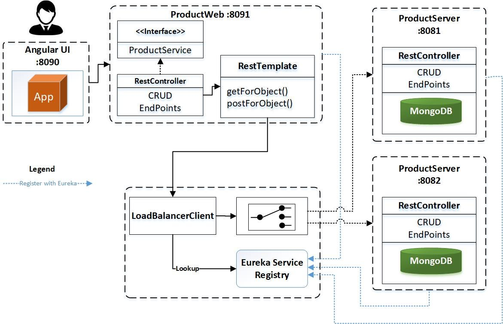
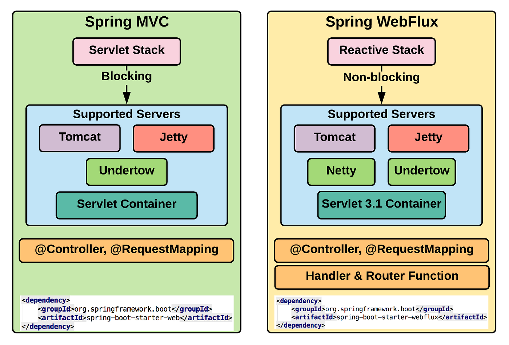

# Part 8: Eureka Service Discovery & Gateway Integration

## 1. Introduction: Why Service Discovery?

In a microservices architecture, services often scale dynamically, changing their IP addresses and ports. Hardcoding these addresses (e.g., `localhost:8080`) is brittle and unmanageable.

**Eureka** solves this by acting as a **Service Registry** (a phonebook for services).
1. **Registration**: Services (Product, Order, Inventory) register themselves with Eureka at startup.
2. **Discovery**: The Gateway queries Eureka to find the current location (IP:Port) of a service before forwarding a request.



---

## 2. Step-by-Step Implementation

### A. Setting up the Eureka Server (`eureka-service`)

1.  **Dependencies**: Added `spring-cloud-starter-netflix-eureka-server`.
2.  **Enable Server**: Added `@EnableEurekaServer` to the main application class.
3.  **Configuration** (`application.properties`):
    *   `server.port=8761`: Standard Eureka port.
    *   `eureka.client.register-with-eureka=false`: It's a server, not a client.
    *   `eureka.client.fetch-registry=false`: It maintains the registry, doesn't need to fetch it.

### B. Configuring the Gateway (`gateway-service`)

The Gateway needs to act as a **Eureka Client** to look up other services.

1.  **Dependencies**:
    *   `spring-cloud-starter-netflix-eureka-client`: To communicate with Eureka.
    *   `spring-cloud-starter-loadbalancer`: **CRITICAL**. Required to handle multiple instances of a service and resolve logical names (e.g., `product-service`) to physical addresses.
    *   `spring-cloud-starter-gateway-server-webmvc`: The Gateway MVC implementation.

2.  **Configuration**:
    *   `eureka.client.service-url.defaultZone=http://localhost:8761/eureka/`: Points to the Eureka Server.

---

## 3. Synchronizing Gateway Forwarding with Eureka

We implemented a dynamic routing mechanism that resolves service names on the fly.

### The Challenge
Spring Cloud Gateway MVC normally routes to static URLs. To route to `product-service`, we can't just send the request blindly; we need to know *which* instance to call (e.g., `192.168.1.5:8080`).

### The Solution: Custom `ServiceResolver`

We created a component `ServiceResolver` that uses the `LoadBalancerClient` to talk to Eureka.

```java
// ServiceResolver.java
// 1. Ask LoadBalancerClient for an available instance of "product-service"
ServiceInstance instance = loadBalancerClient.choose("product-service");

// 2. Get the actual URI (e.g., http://192.168.1.5:8080)
return URI.create(instance.getUri().toString() + path);
```

Then, in our `Routes.java`, we use this resolver for every request:

```java
// Routes.java
.route(RequestPredicates.path("/api/product/**"), request -> {
    // RESOLVE: "product-service" -> "http://192.168.1.5:8080"
    URI resolvedUri = serviceResolver.resolve("product-service", path);
    
    // FORWARD: Update the request URL to the resolved physical address
    MvcUtils.setRequestUrl(newRequest, resolvedUri);
    return HandlerFunctions.http().handle(newRequest);
})
```

**Why is this sync necessary?**
This ensures that if we scale `product-service` to 5 instances, the Gateway will automatically discover all 5 and distribute traffic among them (Round Robin by default), without restarting the Gateway.

---

## 4. Spring Cloud Gateway: MVC vs Reactive

We chose **Gateway MVC** generally for simplicity and compatibility with blocking imperative logic (like JDBC), but it's important to understand the trade-offs vs the Reactive stack (WebFlux).



### Why we need the Load Balancer?

In **Reactive Gateway**, the `lb://` protocol is built-in largely due to the non-blocking nature of `WebClient`.

In **Gateway MVC**, which runs on Tomcat (Blocking Servlet API), the internal `RestClient` needs explicit help to resolving service names.
*   We added `spring-cloud-starter-loadbalancer`.
*   This grants us the `LoadBalancerClient` bean.
*   Without this, the Gateway would see `product-service` as just a hostname and fail with `UnknownHostException` (or similar), because DNS doesn't know about "product-service"—only Eureka does.

### Comparison Summary

| Feature | Gateway MVC (Our Choice) | Gateway Reactive |
| :--- | :--- | :--- |
| **Underlying Tech** | Servlet API (Tomcat/Jetty) | Project Reactor (Netty) |
| **Model** | Blocking / Thread-per-request | Non-blocking / Event Loop |
| **Debugging** | Standard Stack Traces (Easy) | Async Stack Traces (Hard) |
| **Load Balancing** | Requires explicit `LoadBalancerClient` integration | Native `lb://` support via WebClient |
| **Best For** | Consistency with other MVC microservices | High-throughput edge services |

---

# 📘 Full Technical Report: Service Discovery, Load Balancing, and Gateway Communication in Spring Boot 4

## 1. Introduction

In modern microservices architectures, services must communicate reliably, scalably, and dynamically. Hard-coding service addresses is not feasible due to scaling, failures, and dynamic environments. Spring Cloud provides a robust ecosystem to solve this using **Service Discovery (Eureka)**, **Client-Side Load Balancing (Spring Cloud LoadBalancer)**, and **API Gateway (Spring Cloud Gateway – MVC or Reactive)**.

This report explains **how these components interact**, **who sends requests**, **where the load balancer lives**, and **why each component is required**, specifically in the context of **Spring Boot 4, Java 21, and MVC Gateway**.

---

## 2. Key Components Overview

### 2.1 Eureka Server

**Role:**

* Central service registry
* Knows *what services exist* and *where they are running*

**Responsibilities:**

* Accept service registrations
* Maintain service instance metadata (host, port, status)
* Provide registry data to clients

**Important:**

> Eureka **never forwards requests** and **never participates in runtime request routing**.

---

### 2.2 Eureka Client

**Role:**

* Runs inside every microservice and gateway

**Responsibilities:**

* Registers the service to Eureka Server
* Sends periodic heartbeats
* Fetches the service registry
* Maintains an **in-memory cache** of instances

**Communication Type:**

* HTTP (REST) calls to Eureka Server
* Happens periodically, not per request

---

### 2.3 Spring Cloud LoadBalancer

**Role:**

* Client-side load balancing library

**What it is:**

* ❌ Not a service
* ❌ No port
* ❌ No deployment
* ✅ Pure Java library running inside your application

**Responsibilities:**

* Selects one service instance from available ones
* Uses strategies like Round-Robin, Random, or Custom

**Important:**

> LoadBalancer does NOT communicate with Eureka Server directly.

It relies on:

```
Eureka Client → In-memory registry cache
```

---

### 2.4 Spring Cloud Gateway (MVC)

**Role:**

* Entry point for client requests
* Routes requests to backend services

**Responsibilities:**

* Route matching
* Authentication / Authorization
* Forwarding requests
* Observability and metrics

**MVC vs Reactive:**

* MVC Gateway uses Servlet stack (Tomcat)
* Reactive Gateway uses WebFlux (Netty)

This report focuses on **MVC Gateway with LoadBalancer**.

---

## 3. End-to-End Request Flow

### 3.1 High-Level Flow

```
Client
  ↓
Gateway (MVC)
  ↓
Spring Cloud LoadBalancer
  ↓
Eureka Client (local cache)
  ↓
Chosen Service Instance
  ↓
HTTP request to target service
```

---

### 3.2 Detailed Step-by-Step Flow

1. Client sends request to Gateway:

   ```
   GET /api/product/1
   ```

2. Gateway route matches `/api/product/**`

3. Gateway detects:

   ```
   lb://product-service
   ```

4. Gateway asks LoadBalancer (Java method call):

   ```java
   loadBalancer.choose("product-service")
   ```

5. LoadBalancer queries Eureka Client cache:

   ```java
   discoveryClient.getInstances("product-service")
   ```

6. One instance is selected:

   ```
   http://localhost:8082
   ```

7. Gateway forwards HTTP request to Product Service

---

## 4. Why a Load Balancer Is Required

### Without LoadBalancer

* Gateway cannot interpret `lb://`
* Gateway does not know which instance to choose
* Results in:

  ```
  Unroutable protocol scheme: lb://product-service
  ```

### With LoadBalancer

* Service name → instance resolution
* Supports:

  * Horizontal scaling
  * Failover
  * Zero hard-coded URLs

---

## 5. Is Eureka Enough Without LoadBalancer?

❌ No.

**Eureka answers:**

> "What instances exist?"

**LoadBalancer answers:**

> "Which instance should I use *now*?"

They solve **different problems**.

---

## 6. Client-Side Load Balancing Explained

### Why client-side?

* No extra infrastructure
* Faster (no proxy hop)
* More resilient

### Comparison

| Type        | Example                   | Location         |
| ----------- | ------------------------- | ---------------- |
| Client-side | Spring Cloud LoadBalancer | Inside app       |
| Server-side | NGINX, HAProxy            | External service |

---

## 7. Actuator's Role in This Architecture

### What Actuator Provides

* `/actuator/health`
* `/actuator/info`
* `/actuator/metrics`
* `/actuator/gateway/routes`

### Why It Matters

1. Eureka uses health status
2. Gateway monitoring
3. Observability & diagnostics

### Configuration Explained

```properties
management.endpoint.health.show-details=always
```

**Effect:**

* Shows full health details
* Includes:

  * Disk space
  * DB
  * Discovery status

⚠️ Should be restricted in production

---

## 8. MVC Gateway vs Reactive Gateway

| Aspect     | MVC Gateway          | Reactive Gateway        |
| ---------- | -------------------- | ----------------------- |
| Stack      | Servlet / Tomcat     | WebFlux / Netty         |
| Threading  | Blocking             | Non-blocking            |
| Complexity | Lower                | Higher                  |
| Best for   | Traditional services | High-throughput systems |

**Your choice (MVC Gateway) is correct if:**

* Backend services are blocking
* Team is not fully reactive
* You want simplicity and clarity

---

## 9. Where Each Component Runs

| Component     | Deployment                  |
| ------------- | --------------------------- |
| Eureka Server | Separate service            |
| Gateway       | Microservice                |
| LoadBalancer  | Library inside Gateway      |
| Eureka Client | Library inside each service |

---

## 10. Common Misconceptions (Corrected)

❌ Eureka forwards requests → **FALSE**
❌ LoadBalancer is a service → **FALSE**
❌ Eureka queried per request → **FALSE**

✅ Gateway sends requests
✅ LoadBalancer selects instance
✅ Eureka provides registry

---

## 11. Conclusion

This architecture achieves:

* Loose coupling
* Horizontal scalability
* High availability
* Clear separation of concerns

By combining:

* **Eureka (Discovery)**
* **Spring Cloud LoadBalancer (Selection)**
* **Spring Cloud Gateway MVC (Routing)**

You get a production-grade microservices communication model aligned with Spring Boot 4 best practices.

---

## 12. One-Sentence Summary

> In Spring Boot microservices, the Gateway sends requests, the LoadBalancer selects instances using Eureka client's cached registry, and Eureka itself only provides service discovery—not request routing.
