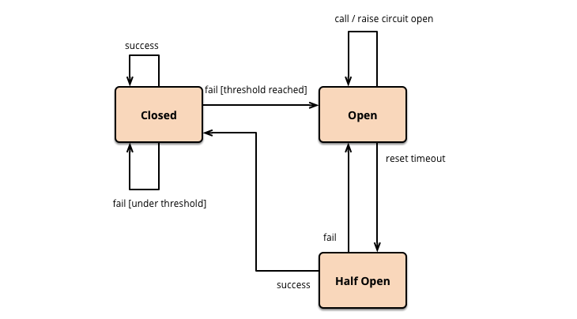
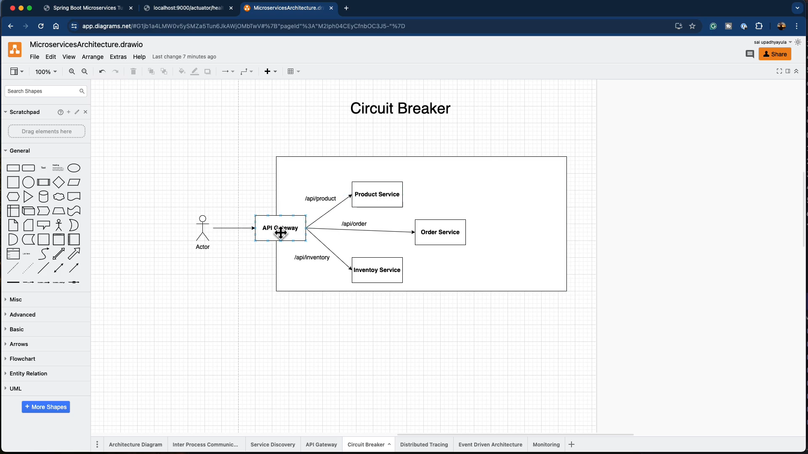
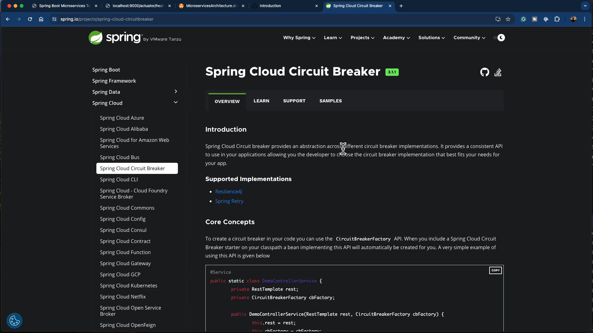

we will use resiliency4j 
- rate limiter
- circuit breaker
- bulkhead pattern 
- we will use spring cloud circuit breaker



1- add this dependency in the pom.xml of the order service
```xml
<dependency>
    <groupId>org.springframework.cloud</groupId>
    <artifactId>spring-cloud-starter-circuitbreaker-reactor-resilience4j</artifactId>
</dependency>
```