<div align="center">

<table width="100%">
<tr>
<td width="50%" align="left">

</td>
<td width="50%" align="right">

</td>
</tr>
</table>

`<br/><br/>``<br/>`

# Rapport de projet

**5ème année**

**Ingénierie Informatique et Réseaux**

`<br/><br/>`

**Sous le thème**

<br/>

---

# SPRING_CommerceFlow-MS

## Conception et Développement d'une Plateforme E-Commerce Basée sur une Architecture Microservices

---

`<br/><br/>`

**Réalisé par :**

**MAJJID Ayoub**

**EL HILALI Ayman**

<br/>

**Encadré par :**

**Tuteur de l'école : Prof. Hatim JAADOUNI**

`<br/><br/>`

**Année Universitaire : 2025-2026**

</div>

---

<div align="center">

# DÉDICACE

</div>

*À nos familles,*

Pour leur soutien inconditionnel, leur amour et leur encouragement constants tout au long de ce parcours académique.

*À nos parents,*

Qui ont toujours cru en nous et nous ont encouragés à poursuivre nos rêves.

*À nos professeurs et mentors,*

Pour leur sagesse et leurs conseils précieux.

---

<div align="center">

# REMERCIEMENTS

</div>

Nous tenons à exprimer notre profonde gratitude à toutes les personnes qui ont contribué à la réalisation de ce projet.

Nous remercions sincèrement **Prof. Hatim JAADOUNI**, notre encadrant, pour son expertise, ses conseils avisés et sa disponibilité tout au long de ce projet.

Nous remercions également l'**École Marocaine des Sciences de l'Ingénieur (EMSI)** et tout le corps professoral pour la qualité de l'enseignement dispensé.

Enfin, nous exprimons notre reconnaissance à nos familles pour leur soutien inconditionnel.

---

<div align="center">

# RÉSUMÉ

</div>

Ce rapport présente notre projet de fin d'année portant sur la conception et le développement d'une plateforme e-commerce basée sur une **architecture microservices** utilisant **Spring Boot** et **Spring Cloud**.

Dans un contexte où les applications monolithiques montrent leurs limites en termes de scalabilité et de maintenabilité, l'adoption d'une architecture microservices s'impose comme solution de référence pour les entreprises modernes.

> **⚠️ Note :** Ce projet est actuellement **en cours de développement**. Les composants principaux sont fonctionnels, mais certaines fonctionnalités avancées sont encore en phase d'implémentation.

Le système en développement comprend **4 microservices** (Product, Order, Inventory, Notification), une **API Gateway centralisée**, une **persistance polyglotte** (MongoDB + MySQL), et une **sécurité OAuth2/OIDC** avec Keycloak.

**Mots-clés :** Microservices, Spring Boot, Spring Cloud, API Gateway, Keycloak, Docker, OAuth2, JWT

---

<div align="center">

# ABSTRACT

</div>

This report presents our final year project focusing on the design and development of an e-commerce platform based on a **microservices architecture** using **Spring Boot** and **Spring Cloud**.

In a context where monolithic applications show their limitations in terms of scalability and maintainability, adopting a microservices architecture becomes the reference solution for modern enterprises.

> **⚠️ Note:** This project is currently **under active development**. Core components are functional, while advanced features are being implemented.

The system under development includes **4 microservices** (Product, Order, Inventory, Notification), a **centralized API Gateway**, **polyglot persistence** (MongoDB + MySQL), and **OAuth2/OIDC security** with Keycloak.

**Keywords:** Microservices, Spring Boot, Spring Cloud, API Gateway, Keycloak, Docker, OAuth2, JWT

---

<div align="center">

# TABLE DES MATIÈRES

</div>

1. [Introduction et Contexte](#chapitre-1--introduction-et-contexte)
2. [Revue de Littérature et Contexte Technologique](#chapitre-2--revue-de-littérature-et-contexte-technologique)
3. [Analyse et Expression des Besoins](#chapitre-3--analyse-et-expression-des-besoins)
4. [Conception du Système](#chapitre-4--conception-du-système)
5. [Réalisation et Implémentation](#chapitre-5--réalisation-et-implémentation)
6. [Tests et Validation](#chapitre-6--tests-et-validation)
7. [Résultats et Discussion](#chapitre-7--résultats-et-discussion)
8. [Conclusion et Perspectives](#conclusion-et-perspectives)
9. [Webographie](#webographie)
10. [Annexes](#annexes)

---

<div align="center">

# LISTE DES ABRÉVIATIONS

</div>

| Abréviation | Signification                                  |
| ------------ | ---------------------------------------------- |
| API          | Application Programming Interface              |
| CI/CD        | Continuous Integration / Continuous Deployment |
| DTO          | Data Transfer Object                           |
| E2E          | End-to-End                                     |
| HTTP         | HyperText Transfer Protocol                    |
| IAM          | Identity and Access Management                 |
| JPA          | Java Persistence API                           |
| JSON         | JavaScript Object Notation                     |
| JWT          | JSON Web Token                                 |
| MVC          | Model-View-Controller                          |
| NoSQL        | Not Only SQL                                   |
| OAuth        | Open Authorization                             |
| OIDC         | OpenID Connect                                 |
| ORM          | Object-Relational Mapping                      |
| RBAC         | Role-Based Access Control                      |
| REST         | Representational State Transfer                |
| SOA          | Service-Oriented Architecture                  |
| SQL          | Structured Query Language                      |
| SSO          | Single Sign-On                                 |

---

<div align="center">

# CHAPITRE 1

## INTRODUCTION ET CONTEXTE

</div>

### 1.1 Introduction Générale

Dans le paysage technologique actuel, les exigences des applications d'entreprise ont considérablement évolué. Les utilisateurs attendent des systèmes **performants**, **disponibles 24/7**, et capables de **s'adapter rapidement** aux changements du marché. Face à ces défis, l'architecture **microservices** s'est imposée comme une solution de référence, permettant de construire des applications sous forme de **services autonomes**, faiblement couplés et indépendamment déployables. Ce projet s'inscrit dans cette démarche en proposant la conception et le développement d'une plateforme e-commerce moderne basée sur l'écosystème **Spring Boot** et **Spring Cloud**.

### 1.2 Problématique

Les architectures monolithiques traditionnelles présentent plusieurs limitations critiques :

| Problème                       | Impact sur l'Entreprise                                                |
| ------------------------------- | ---------------------------------------------------------------------- |
| **Couplage fort**         | Une modification nécessite le redéploiement complet de l'application |
| **Scalabilité limitée** | Impossible de scaler un seul composant indépendamment                 |
| **Technologie unique**    | Obligation d'utiliser le même langage pour toute l'application        |
| **Déploiement risqué**  | Un bug dans un module affecte l'ensemble du système                   |

> **Question Centrale :** Comment concevoir un système distribué capable de gérer les opérations e-commerce (produits, commandes, inventaire) de manière **scalable**, **résiliente** et **sécurisée**, tout en maintenant une **indépendance technologique** entre les composants ?

### 1.3 Objectifs du Projet

| Catégorie               | Objectif                                         | Métrique de Succès      |
| ------------------------ | ------------------------------------------------ | ------------------------- |
| **Architecture**   | Concevoir une architecture microservices robuste | 4+ services indépendants |
| **Développement** | Implémenter les services métier                | CRUD complet par service  |
| **Intégration**   | Établir la communication inter-services         | OpenFeign fonctionnel     |
| **Sécurité**     | Mettre en place OAuth2/OIDC                      | Keycloak intégré        |
| **Qualité**       | Assurer la couverture de tests                   | > 70% coverage            |

### 1.4 Périmètre du Projet

<div align="center">

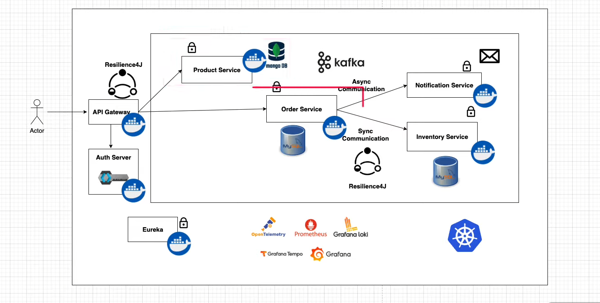

*Figure 1.1 — Périmètre fonctionnel du projet SPRING_CommerceFlow-MS*

</div>

**Dans le Périmètre :** Product Service • Order Service • Inventory Service • API Gateway • Sécurité OAuth2 • Tests automatisés

**Hors Périmètre (Travaux Futurs) :** Service de paiement • Frontend • Kubernetes • Notification Service

### 1.5 Organisation du Document

Ce rapport est structuré en **7 chapitres** : Introduction → Revue de Littérature → Analyse des Besoins → Conception → Réalisation → Tests → Résultats, suivis de la Conclusion, Webographie et Annexes.

---

<div align="center">

# CHAPITRE 2

## REVUE DE LITTÉRATURE ET CONTEXTE TECHNOLOGIQUE

</div>

### 2.1 Évolution des Architectures Logicielles

### 2.1.1 Du Monolithique aux Microservices : Une Histoire d'Évolution

L'architecture logicielle a connu une évolution significative au cours des dernières décennies, passant progressivement de systèmes monolithiques à des architectures distribuées.

```
┌─────────────────────────────────────────────────────────────────────────────────┐
│                    ÉVOLUTION DES ARCHITECTURES LOGICIELLES                      │
├─────────────────────────────────────────────────────────────────────────────────┤
│                                                                                  │
│   1990s              2000s              2010s              2020s                │
│     │                  │                  │                  │                  │
│     ▼                  ▼                  ▼                  ▼                  │
│  ┌──────┐          ┌──────┐          ┌──────┐          ┌──────┐                │
│  │MONOL │    →     │ SOA  │    →     │MICRO │    →     │CLOUD │                │
│  │ITHE  │          │      │          │SERVS │          │NATIVE│                │
│  └──────┘          └──────┘          └──────┘          └──────┘                │
│                                                                                  │
└─────────────────────────────────────────────────────────────────────────────────┘
```

### 2.1.2 Architecture Monolithique

L'architecture monolithique regroupe toutes les fonctionnalités dans une seule unité déployable.

**Caractéristiques :**

- Base de code unique
- Déploiement tout-en-un
- Scaling vertical uniquement

**Limitations :**

- Temps de démarrage long
- Déploiement risqué
- Difficile à maintenir à grande échelle

### 2.1.3 Architecture MVC

Le pattern **Model-View-Controller** a apporté une première forme de séparation des préoccupations.

```
┌─────────────────────────────────────────────────────────────────────────────────┐
│                           ARCHITECTURE MVC                                       │
├─────────────────────────────────────────────────────────────────────────────────┤
│                                                                                  │
│                              ┌───────────┐                                      │
│                              │   USER    │                                      │
│                              └─────┬─────┘                                      │
│                                    │                                            │
│                                    ▼                                            │
│                              ┌───────────┐                                      │
│                              │   VIEW    │ ← Présentation                       │
│                              └─────┬─────┘                                      │
│                                    │                                            │
│                                    ▼                                            │
│                           ┌────────────────┐                                    │
│                           │   CONTROLLER   │ ← Logique de contrôle             │
│                           └────────┬───────┘                                    │
│                                    │                                            │
│                                    ▼                                            │
│                              ┌───────────┐                                      │
│                              │   MODEL   │ ← Données et logique métier         │
│                              └───────────┘                                      │
│                                                                                  │
└─────────────────────────────────────────────────────────────────────────────────┘
```

### 2.1.4 Architecture Orientée Services (SOA)

SOA a introduit la notion de services réutilisables communiquant via des protocoles standards.

| Aspect                     | SOA             | Microservices    |
| -------------------------- | --------------- | ---------------- |
| **Couplage**         | Moyenne         | Faible           |
| **Granularité**     | Services larges | Services fins    |
| **Communication**    | ESB centralisé | API REST directe |
| **Base de données** | Partagée       | Par service      |

### 2.1.5 Architecture Microservices

L'architecture microservices décompose l'application en **services autonomes**, chacun responsable d'une fonctionnalité métier spécifique.

```
┌─────────────────────────────────────────────────────────────────────────────────┐
│                        ARCHITECTURE MICROSERVICES                                │
├─────────────────────────────────────────────────────────────────────────────────┤
│                                                                                  │
│                           ┌─────────────────┐                                   │
│                           │   API GATEWAY   │                                   │
│                           └────────┬────────┘                                   │
│                                    │                                            │
│              ┌─────────────────────┼─────────────────────┐                     │
│              │                     │                     │                      │
│        ┌─────▼─────┐         ┌─────▼─────┐         ┌─────▼─────┐               │
│        │  PRODUCT  │         │   ORDER   │         │ INVENTORY │               │
│        │  SERVICE  │         │  SERVICE  │         │  SERVICE  │               │
│        └─────┬─────┘         └─────┬─────┘         └─────┬─────┘               │
│              │                     │                     │                      │
│        ┌─────▼─────┐         ┌─────▼─────┐         ┌─────▼─────┐               │
│        │  MongoDB  │         │   MySQL   │         │   MySQL   │               │
│        └───────────┘         └───────────┘         └───────────┘               │
│                                                                                  │
│   ✅ Chaque service a sa propre base de données (Polyglot Persistence)         │
│   ✅ Communication via REST API ou Messaging                                   │
│   ✅ Déploiement indépendant                                                    │
│                                                                                  │
└─────────────────────────────────────────────────────────────────────────────────┘
```

**Principes Clés :**

1. **Single Responsibility** : Un service = une fonctionnalité métier
2. **Autonomie** : Chaque service peut être développé/déployé indépendamment
3. **Décentralisation** : Pas de point central de contrôle
4. **Résilience** : La défaillance d'un service n'affecte pas les autres

### 2.1.6 Tableau Comparatif

| Critère               | Monolithique     | SOA                | Microservices             |
| ---------------------- | ---------------- | ------------------ | ------------------------- |
| **Déploiement** | Tout ensemble    | Par groupe         | Par service               |
| **Scaling**      | Vertical         | Horizontal limité | Horizontal granulaire     |
| **Technologie**  | Unique           | Variée limitée   | Polyglotte                |
| **Équipes**     | Centralisée     | Par domaine        | Par service               |
| **Complexité**  | Simple au début | Moyenne            | Élevée (infrastructure) |

---

## 2.2 Concepts Cloud-Native

### 2.2.1 Définition

Une application **Cloud-Native** est conçue spécifiquement pour tirer parti des environnements cloud modernes.

```
┌─────────────────────────────────────────────────────────────────────────────────┐
│                       CARACTÉRISTIQUES CLOUD-NATIVE                              │
├─────────────────────────────────────────────────────────────────────────────────┤
│                                                                                  │
│   ┌─────────────┐  ┌─────────────┐  ┌─────────────┐  ┌─────────────┐           │
│   │ CONTENEURS  │  │ ORCHESTRAT. │  │   CI/CD     │  │ OBSERVABIL. │           │
│   │   Docker    │  │ Kubernetes  │  │   GitOps    │  │   Logs      │           │
│   └─────────────┘  └─────────────┘  └─────────────┘  └─────────────┘           │
│                                                                                  │
│   ✅ Scalabilité automatique       ✅ Haute disponibilité                       │
│   ✅ Déploiement rapide            ✅ Tolérance aux pannes                      │
│                                                                                  │
└─────────────────────────────────────────────────────────────────────────────────┘
```

### 2.2.2 Conteneurisation avec Docker

Docker permet de packager une application avec toutes ses dépendances dans un **conteneur** isolé.

**Avantages :**

- **Portabilité** : "Build once, run anywhere"
- **Isolation** : Chaque service dans son environnement
- **Légèreté** : Partage du kernel de l'hôte

### 2.2.3 Orchestration avec Kubernetes

Kubernetes gère le déploiement, la mise à l'échelle et la gestion des applications conteneurisées.

| Composant            | Rôle                          |
| -------------------- | ------------------------------ |
| **Pod**        | Plus petite unité déployable |
| **Service**    | Exposition réseau stable      |
| **Deployment** | Gestion du cycle de vie        |
| **Ingress**    | Routage HTTP externe           |

---

## 2.3 L'Écosystème Spring

### 2.3.1 Spring Boot

<div >

</div>

**Spring Boot** simplifie la création d'applications Spring production-ready.

**Caractéristiques :**

- Configuration automatique (Auto-configuration)
- Serveur embarqué (Tomcat)
- Actuators pour le monitoring
- Profils d'environnement

### 2.3.2 Spring Cloud

<div >

</div>

**Spring Cloud** fournit les outils pour construire des systèmes distribués.

| Composant                        | Fonction                   |
| -------------------------------- | -------------------------- |
| **Spring Cloud Gateway**   | API Gateway et routage     |
| **Spring Cloud OpenFeign** | Client HTTP déclaratif    |
| **Spring Cloud Config**    | Configuration centralisée |
| **Eureka**                 | Service Discovery          |

---

## 2.4 Sécurité dans les Microservices

### 2.4.1 Défis de la Sécurité Distribuée

Dans une architecture microservices, la sécurité doit être gérée de manière **centralisée** mais **appliquée** de manière **distribuée**.

### 2.4.2 OAuth 2.0 et OpenID Connect

| Protocole                | Rôle                                         |
| ------------------------ | --------------------------------------------- |
| **OAuth 2.0**      | Autorisation (accès aux ressources)          |
| **OpenID Connect** | Authentification (identité de l'utilisateur) |

### 2.4.3 Keycloak

<div >
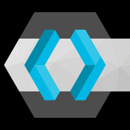
</div>

**Keycloak** est une solution IAM open-source développée par Red Hat.

**Fonctionnalités :**

- Single Sign-On (SSO)
- Identity Brokering (Google, GitHub, LDAP)
- Gestion des utilisateurs et rôles
- Tokens JWT

---

## 2.5 Conclusion du Chapitre

Ce chapitre a présenté l'évolution des architectures logicielles, des systèmes monolithiques aux approches cloud-native. Les microservices, combinés à Spring Boot et Spring Cloud, offrent une solution moderne pour construire des applications scalables et maintenables.

---

<div align="center">

# CHAPITRE 3

## ANALYSE ET EXPRESSION DES BESOINS

</div>

### 3.1 Analyse de l'Existant

Dans le contexte e-commerce traditionnel, les solutions monolithiques présentent les limitations suivantes :

| Problème Identifié                    | Impact Métier                   |
| --------------------------------------- | -------------------------------- |
| Indisponibilité lors des mises à jour | Perte de revenus                 |
| Scalabilité limitée pendant les pics  | Mauvaise expérience utilisateur |
| Couplage des équipes de développement | Cycle de release rallongé       |
| Single point of failure                 | Risque d'arrêt total            |

## 3.2 Besoins Fonctionnels

### 3.2.1 Gestion des Produits (Product Service)

| ID      | Exigence                                | Priorité | Statut          |
| ------- | --------------------------------------- | --------- | --------------- |
| FR-P-01 | Créer un nouveau produit               | Haute     | ✅ Implémenté |
| FR-P-02 | Consulter les détails d'un produit     | Haute     | ✅ Implémenté |
| FR-P-03 | Mettre à jour les informations produit | Moyenne   | ✅ Implémenté |
| FR-P-04 | Supprimer un produit                    | Moyenne   | ✅ Implémenté |
| FR-P-05 | Lister tous les produits                | Haute     | ✅ Implémenté |

### 3.2.2 Gestion des Commandes (Order Service)

| ID      | Exigence                                 | Priorité | Statut          |
| ------- | ---------------------------------------- | --------- | --------------- |
| FR-O-01 | Passer une nouvelle commande             | Haute     | ✅ Implémenté |
| FR-O-02 | Valider la disponibilité avant commande | Haute     | ✅ Implémenté |
| FR-O-03 | Annuler une commande                     | Haute     | ✅ Implémenté |
| FR-O-04 | Consulter les détails d'une commande    | Haute     | ✅ Implémenté |
| FR-O-05 | Lister toutes les commandes              | Moyenne   | ✅ Implémenté |

### 3.2.3 Gestion de l'Inventaire (Inventory Service)

| ID      | Exigence                              | Priorité | Statut          |
| ------- | ------------------------------------- | --------- | --------------- |
| FR-I-01 | Vérifier la disponibilité en stock  | Haute     | ✅ Implémenté |
| FR-I-02 | Diminuer le stock (vente)             | Haute     | ✅ Implémenté |
| FR-I-03 | Augmenter le stock (achat)            | Haute     | ✅ Implémenté |
| FR-I-04 | Créer un enregistrement d'inventaire | Moyenne   | ✅ Implémenté |
| FR-I-05 | Mettre à jour l'inventaire           | Moyenne   | ✅ Implémenté |

## 3.3 Besoins Non-Fonctionnels

| Catégorie                | Exigence                 | Cible                       |
| ------------------------- | ------------------------ | --------------------------- |
| **Performance**     | Temps de réponse API    | < 200ms (95ème percentile) |
| **Scalabilité**    | Utilisateurs concurrents | 1000+                       |
| **Disponibilité**  | Uptime système          | 99.9%                       |
| **Fiabilité**      | Taux d'erreur            | < 0.1%                      |
| **Maintenabilité** | Couverture de tests      | > 70%                       |
| **Sécurité**      | Chiffrement              | TLS 1.3                     |

## 3.4 Acteurs du Système

```
┌─────────────────────────────────────────────────────────────────────────────────┐
│                           ACTEURS DU SYSTÈME                                     │
├─────────────────────────────────────────────────────────────────────────────────┤
│                                                                                  │
│   ┌─────────────┐              ┌─────────────┐              ┌─────────────┐     │
│   │  CLIENT     │              │  ADMIN      │              │  SYSTÈME    │     │
│   │  (API)      │              │             │              │ (EXTERNE)   │     │
│   └──────┬──────┘              └──────┬──────┘              └──────┬──────┘     │
│          │                            │                            │            │
│          ▼                            ▼                            ▼            │
│   • Consulter produits         • Gérer produits             • Vérifier stock   │
│   • Passer commandes           • Gérer inventaire           • Envoyer notifs   │
│   • Annuler commandes          • Voir analytics                                 │
│                                                                                  │
└─────────────────────────────────────────────────────────────────────────────────┘
```

## 3.5 Contraintes du Projet

| Type                 | Contrainte                                |
| -------------------- | ----------------------------------------- |
| **Technique**  | Utilisation de Spring Boot 4.0 et Java 21 |
| **Technique**  | Persistance polyglotte (MongoDB + MySQL)  |
| **Temporelle** | Livraison en Janvier 2025                 |
| **Budget**     | Outils open-source uniquement             |

## 3.6 Conclusion du Chapitre

L'analyse des besoins a permis d'identifier 15 exigences fonctionnelles réparties entre les trois services métier principaux, ainsi que des critères de performance et de disponibilité stricts.

---

<div align="center">

# CHAPITRE 4

## CONCEPTION DU SYSTÈME

</div>

### 4.1 Architecture Générale

### 4.1.1 Vue d'Ensemble

Notre plateforme **SPRING_CommerceFlow-MS** est conçue selon une architecture microservices complète intégrant tous les composants nécessaires à un système distribué moderne.

> **📌 Lien du Projet Portfolio :**
> [https://majjid.com/project.html?project=#spring-commerceflow-ms](https://majjid.com/project.html?project=#spring-commerceflow-ms)

### 4.1.2 Diagramme d'Architecture


*Figure 4.1 : Architecture globale du système montrant les 4 microservices, leurs bases de données respectives, et les composants d'infrastructure*

```
┌─────────────────────────────────────────────────────────────────────────────────┐
│                    ARCHITECTURE GÉNÉRALE DU SYSTÈME                              │
├─────────────────────────────────────────────────────────────────────────────────┤
│                                                                                  │
│   ┌────────────────────────────────────────────────────────────────────────┐    │
│   │                           API GATEWAY                                   │    │
│   │                    (Point d'Entrée Unique)                             │    │
│   └────────────────────────────────┬───────────────────────────────────────┘    │
│                                    │                                            │
│              ┌─────────────────────┼─────────────────────┐                     │
│              │                     │                     │                      │
│        ┌─────▼─────┐         ┌─────▼─────┐         ┌─────▼─────┐               │
│        │  PRODUCT  │         │   ORDER   │         │ INVENTORY │               │
│        │  SERVICE  │────────▶│  SERVICE  │◀───────▶│  SERVICE  │               │
│        │  :8080    │         │   :8081   │         │   :8082   │               │
│        └─────┬─────┘         └─────┬─────┘         └─────┬─────┘               │
│              │                     │                     │                      │
│        ┌─────▼─────┐         ┌─────▼─────┐         ┌─────▼─────┐               │
│        │  MongoDB  │         │   MySQL   │         │   MySQL   │               │
│        │ (NoSQL)   │         │  (ACID)   │         │  (ACID)   │               │
│        └───────────┘         └───────────┘         └───────────┘               │
│                                                                                  │
│   ┌────────────────────────────────────────────────────────────────────────┐    │
│   │                    INFRASTRUCTURE LAYER                                 │    │
│   │  ┌──────────┐  ┌──────────┐  ┌──────────┐  ┌──────────┐               │    │
│   │  │ KEYCLOAK │  │  EUREKA  │  │   KAFKA  │  │  DOCKER  │               │    │
│   │  │ (Auth)   │  │(Discovery)│  │(Messaging)│  │(Containers)│              │    │
│   │  └──────────┘  └──────────┘  └──────────┘  └──────────┘               │    │
│   └────────────────────────────────────────────────────────────────────────┘    │
│                                                                                  │
└─────────────────────────────────────────────────────────────────────────────────┘
```

### 4.1.3 Description Détaillée des Services

#### 🛍️ **Product Service** (Port 8080)

| Aspect                     | Détail                                                |
| -------------------------- | ------------------------------------------------------ |
| **Objectif**         | Gestion du catalogue produits                          |
| **Base de données** | MongoDB (NoSQL)                                        |
| **Justification DB** | Schéma flexible pour les attributs produits variables |

**Fonctionnalités Clés :**

- Opérations CRUD complètes sur les produits
- Attributs produits flexibles (sans schéma rigide)
- Performance de lecture optimisée

---

#### 📦 **Order Service** (Port 8081)

| Aspect                     | Détail                          |
| -------------------------- | -------------------------------- |
| **Objectif**         | Traitement des commandes clients |
| **Base de données** | MySQL (conformité ACID)         |
| **Dépendances**     | Inventory Service via OpenFeign  |

**Fonctionnalités Clés :**

- Placement de commandes
- Annulation de commandes
- Validation de l'inventaire avant confirmation
- Gestion sophistiquée des erreurs

---

#### 📊 **Inventory Service** (Port 8082)

| Aspect                     | Détail                                 |
| -------------------------- | --------------------------------------- |
| **Objectif**         | Suivi des niveaux de stock              |
| **Base de données** | MySQL (intégrité transactionnelle)    |
| **Transactions**     | Supportées pour garantir la cohérence |

**Fonctionnalités Clés :**

- Gestion des stocks (création, mise à jour)
- Opérations de vente (décrémentation)
- Opérations d'achat (incrémentation)
- Validation des niveaux de stock

---

#### 🔔 **Notification Service** (Port 8083) - *Travail Futur*

| Aspect                | Détail                   |
| --------------------- | ------------------------- |
| **Objectif**    | Envoi de notifications    |
| **Technologie** | Consommateur Kafka        |
| **Type**        | Event-driven architecture |

**Fonctionnalités Clés (Planifiées) :**

- Traitement asynchrone des messages
- Notifications Email/SMS
- Architecture orientée événements

---

### 4.1.4 Composants d'Infrastructure

| Composant                   | Technologie          |                                                           Icon                                                           | Rôle                                            |
| --------------------------- | -------------------- | :----------------------------------------------------------------------------------------------------------------------: | ------------------------------------------------ |
| **API Gateway**       | Spring Cloud Gateway | `` | Routage, sécurité centralisée, load balancing |
| **Service Discovery** | Eureka               | `` | Enregistrement dynamique des services            |
| **Message Broker**    | Apache Kafka         | `` | Communication asynchrone                         |
| **Monitoring**        | Prometheus + Grafana | `` | Métriques et tableaux de bord                   |
| **Tracing**           | Zipkin/Tempo         | `` | Traçage distribué                              |
| **Logging**           | Loki                 | `` | Journalisation centralisée                      |
| **Conteneurisation**  | Docker               | `` | Isolation des services                           |
| **Orchestration**     | Kubernetes           | `` | Gestion des conteneurs                           |

### 4.1.5 Justification des Choix Technologiques

| Composant                   | Technologie          |                                                           Icon                                                           | Justification                                             |
| --------------------------- | -------------------- | :----------------------------------------------------------------------------------------------------------------------: | --------------------------------------------------------- |
| **Product Service**   | MongoDB              | `` | Schéma flexible pour les attributs produits variables    |
| **Order Service**     | MySQL                | `` | Conformité ACID pour les transactions financières       |
| **Inventory Service** | MySQL                | `` | Intégrité transactionnelle pour les mouvements de stock |
| **API Gateway**       | Spring Cloud Gateway | `` | Routage, sécurité centralisée, filtrage                |
| **Communication**     | OpenFeign            | `` | Client HTTP déclaratif et type-safe                      |
| **Sécurité**        | Keycloak             | `` | IAM open-source avec OAuth2/OIDC                          |

---

## 4.2 Architecture Interne des Services

Chaque microservice suit une **architecture en couches** standardisée.

```
┌─────────────────────────────────────────────────────────────────────────────────┐
│                    ARCHITECTURE LAYERED (PAR SERVICE)                            │
├─────────────────────────────────────────────────────────────────────────────────┤
│                                                                                  │
│                              HTTP REQUEST                                        │
│                                   │                                              │
│                                   ▼                                              │
│   ┌─────────────────────────────────────────────────────────────────────────┐   │
│   │                      PRESENTATION LAYER                                  │   │
│   │  ┌─────────────┐                      ┌─────────────┐                   │   │
│   │  │ Controller  │ ◀──── DTO ────▶      │  Mapper     │                   │   │
│   │  │ @RestController│                    │ (MapStruct) │                   │   │
│   │  └──────┬──────┘                      └─────────────┘                   │   │
│   └─────────│───────────────────────────────────────────────────────────────┘   │
│             │                                                                    │
│             ▼                                                                    │
│   ┌─────────────────────────────────────────────────────────────────────────┐   │
│   │                      BUSINESS LOGIC LAYER                                │   │
│   │  ┌─────────────┐                                                        │   │
│   │  │   Service   │ ← Règles métier, Orchestration, Transactions           │   │
│   │  │ @Service    │                                                        │   │
│   │  └──────┬──────┘                                                        │   │
│   └─────────│───────────────────────────────────────────────────────────────┘   │
│             │                                                                    │
│             ▼                                                                    │
│   ┌─────────────────────────────────────────────────────────────────────────┐   │
│   │                      DATA ACCESS LAYER                                   │   │
│   │  ┌─────────────┐                      ┌─────────────┐                   │   │
│   │  │ Repository  │ ◀────────────────▶   │   Entity    │                   │   │
│   │  │ @Repository │                      │   @Entity   │                   │   │
│   │  └──────┬──────┘                      └─────────────┘                   │   │
│   └─────────│───────────────────────────────────────────────────────────────┘   │
│             │                                                                    │
│             ▼                                                                    │
│        ┌─────────┐                                                               │
│        │DATABASE │                                                               │
│        └─────────┘                                                               │
│                                                                                  │
└─────────────────────────────────────────────────────────────────────────────────┘
```

**Rôles des Couches :**

| Couche               | Responsabilité                               |
| -------------------- | --------------------------------------------- |
| **Controller** | Point d'entrée HTTP, validation, mapping DTO |
| **Service**    | Logique métier, orchestration, transactions  |
| **Repository** | Abstraction de l'accès aux données          |
| **Entity**     | Mapping objet-relationnel                     |

---

## 4.3 Description des Services

### 4.3.1 Product Service

| Aspect                     | Détail                       |
| -------------------------- | ----------------------------- |
| **Port**             | 8080                          |
| **Base de données** | MongoDB (NoSQL)               |
| **Fonction**         | Gestion du catalogue produits |

**Endpoints API :**

- `POST /products` - Créer un produit
- `GET /products` - Lister les produits
- `GET /products/{id}` - Détails d'un produit
- `PUT /products/{id}` - Modifier un produit
- `DELETE /products/{id}` - Supprimer un produit

### 4.3.2 Order Service

| Aspect                     | Détail                           |
| -------------------------- | --------------------------------- |
| **Port**             | 8081                              |
| **Base de données** | MySQL (ACID)                      |
| **Fonction**         | Gestion des commandes             |
| **Dépendance**      | Inventory Service (via OpenFeign) |

**Endpoints API :**

- `POST /orders` - Passer une commande
- `GET /orders` - Lister les commandes
- `GET /orders/{id}` - Détails d'une commande
- `POST /orders/{id}/cancel` - Annuler une commande

### 4.3.3 Inventory Service

| Aspect                     | Détail            |
| -------------------------- | ------------------ |
| **Port**             | 8082               |
| **Base de données** | MySQL (ACID)       |
| **Fonction**         | Gestion des stocks |

**Endpoints API :**

- `POST /api/inventory` - Créer un stock
- `GET /api/inventory/{sku}` - Vérifier la disponibilité
- `POST /api/inventory/{sku}/sell` - Vendre (décrémenter)
- `POST /api/inventory/{sku}/purchase` - Acheter (incrémenter)

---

## 4.4 Flux de Données : Placement d'une Commande

```
┌─────────────────────────────────────────────────────────────────────────────────┐
│           FLUX DE DONNÉES : PLACEMENT D'UNE COMMANDE                            │
├─────────────────────────────────────────────────────────────────────────────────┤
│                                                                                  │
│  ÉTAPE 1: Requête Client                                                        │
│  ────────────────────────                                                       │
│  Client ──▶ POST /orders ──▶ API Gateway                                        │
│                                                                                  │
│  ÉTAPE 2: Vérification Sécurité                                                 │
│  ──────────────────────────────                                                 │
│  API Gateway ──▶ Vérifie JWT ──▶ Route vers Order Service                       │
│                                                                                  │
│  ÉTAPE 3: Logique Métier                                                        │
│  ──────────────────────                                                         │
│  Order Service:                                                                  │
│    1. Reçoit la requête                                                         │
│    2. Appel SYNCHRONE vers Inventory Service (OpenFeign)                        │
│       └─▶ "iPhone 15 est-il en stock?"                                          │
│    3. Attend la réponse                                                         │
│    4. Si OUI → Sauvegarde la commande en MySQL                                  │
│                                                                                  │
│  ÉTAPE 4: Notification (Future)                                                 │
│  ─────────────────────────────                                                  │
│  Order Service ──▶ Kafka (message asynchrone) ──▶ Notification Service          │
│                                                                                  │
│  ÉTAPE 5: Réponse                                                               │
│  ───────────────                                                                │
│  Order Service ──▶ API Gateway ──▶ Client                                       │
│    {"orderNumber": "ORD-12345", "status": "PENDING"}                            │
│                                                                                  │
└─────────────────────────────────────────────────────────────────────────────────┘
```

---

## 4.5 Schémas de Base de Données

### MySQL (Order Service)

```sql
CREATE TABLE t_orders (
    id INT AUTO_INCREMENT PRIMARY KEY,
    order_number VARCHAR(50) UNIQUE,
    sku_code VARCHAR(100),
    order_status VARCHAR(20),
    price DECIMAL(10,2),
    quantity INT
);
```

### MySQL (Inventory Service)

```sql
CREATE TABLE t_inventory (
    id BIGINT AUTO_INCREMENT PRIMARY KEY,
    sku_code VARCHAR(100) UNIQUE,
    quantity INT NOT NULL
);
```

### MongoDB (Product Service)

```json
{
  "_id": "ObjectId",
  "name": "String",
  "description": "String",
  "price": "Decimal"
}
```

## 4.6 Design Patterns Utilisés

| Pattern                 | Application                          |
| ----------------------- | ------------------------------------ |
| **Repository**    | Abstraction de l'accès aux données |
| **DTO**           | Transfert de données entre couches  |
| **Mapper**        | Conversion Entity ↔ DTO             |
| **Service Layer** | Encapsulation de la logique métier  |
| **API Gateway**   | Point d'entrée unique               |

## 4.7 Conclusion du Chapitre

La conception du système repose sur une architecture microservices bien structurée, avec une séparation claire des responsabilités entre les services et une architecture interne en couches standard.

---

<div align="center">

# CHAPITRE 5

## RÉALISATION ET IMPLÉMENTATION

</div>

### 5.1 Technologies Utilisées

### 5.1.1 Stack Technique

| Catégorie           | Technologie  | Version  | Rôle                         |
| -------------------- | ------------ | -------- | ----------------------------- |
| **Framework**  | Spring Boot  | 4.0.0    | Framework applicatif          |
| **Cloud**      | Spring Cloud | 2025.1.0 | Outils distribués            |
| **Langage**    | Java         | 21       | Langage de programmation      |
| **Base NoSQL** | MongoDB      | Latest   | Stockage produits             |
| **Base SQL**   | MySQL        | 8.x      | Stockage commandes/inventaire |
| **Migrations** | Flyway       | -        | Versioning du schéma         |
| **Build**      | Maven        | 3.9+     | Gestion des dépendances      |
| **Conteneurs** | Docker       | Latest   | Conteneurisation              |

### 5.1.2 Dépendances Clés

```xml
<!-- Spring Web - API REST -->
<dependency>
    <groupId>org.springframework.boot</groupId>
    <artifactId>spring-boot-starter-web</artifactId>
</dependency>

<!-- Spring Data MongoDB -->
<dependency>
    <groupId>org.springframework.boot</groupId>
    <artifactId>spring-boot-starter-data-mongodb</artifactId>
</dependency>

<!-- Spring Cloud OpenFeign -->
<dependency>
    <groupId>org.springframework.cloud</groupId>
    <artifactId>spring-cloud-starter-openfeign</artifactId>
</dependency>

<!-- Spring Cloud Gateway MVC -->
<dependency>
    <groupId>org.springframework.cloud</groupId>
    <artifactId>spring-cloud-starter-gateway-mvc</artifactId>
</dependency>
```

---

## 5.2 Communication Inter-Services avec OpenFeign

### 5.2.1 Problème Initial

L'approche traditionnelle avec `RestTemplate` est verbeuse et sujette aux erreurs :

```java
// ❌ Ancienne approche avec RestTemplate
RestTemplate restTemplate = new RestTemplate();
String url = "http://localhost:8082/api/inventory/" + skuCode;
ResponseEntity<InventoryResponse> response = 
    restTemplate.getForEntity(url, InventoryResponse.class);
```

### 5.2.2 Solution avec OpenFeignOpenFeign offre une **approche déclarative** et type-safe :

```java
// ✅ Nouvelle approche avec OpenFeign
@FeignClient(name = "inventory-service", url = "${inventory.service.url}")
public interface InventoryClient {
  
    @GetMapping("/api/inventory/{skuCode}")
    InventoryResponse checkInventory(@PathVariable String skuCode);
}
```

### 5.2.3 Avantages

| Avantage              | Description                           |
| --------------------- | ------------------------------------- |
| **Déclaratif** | Interface simple avec annotations     |
| **Type-safe**   | Vérification à la compilation       |
| **Testable**    | Facilement mockable avec WireMock     |
| **Intégré**   | Support natif de la gestion d'erreurs |

---

## 5.3 API Gateway

### 5.3.1 Rôle du Gateway

L'API Gateway centralise les **cross-cutting concerns** :

```
┌─────────────────────────────────────────────────────────────────────────────────┐
│                         RÔLES DE L'API GATEWAY                                   │
├─────────────────────────────────────────────────────────────────────────────────┤
│                                                                                  │
│   🔐 SÉCURITÉ           📊 MONITORING        ⏱️ RATE LIMITING                  │
│   • Auth centralisée    • Logs centralisés   • Anti-abus                        │
│   • Validation JWT      • Métriques          • Quotas                           │
│                                                                                  │
│   🔄 ROUTAGE            ⚖️ LOAD BALANCING    🔧 TRANSFORMATION                  │
│   • Path-based          • Round-robin        • Header manipulation              │
│   • Predicates          • Health checks      • Response filtering               │
│                                                                                  │
└─────────────────────────────────────────────────────────────────────────────────┘
```

### 5.3.2 Configuration des Routes (Java)

```java
@Configuration
public class Routes {

    @Bean
    public RouterFunction<ServerResponse> productServiceRoute() {
        return GatewayRouterFunctions.route("product-service")
            .route(RequestPredicates.path("/api/product/**"),
                request -> {
                    ServerRequest modifiedRequest = ServerRequest.from(request)
                        .uri(URI.create("http://localhost:8080" + 
                            request.requestPath().pathWithinApplication()));
                    return HandlerFunctions.http().handle(modifiedRequest);
                })
            .build();
    }
}
```

---

## 5.4 Service Discovery avec Eureka

### 5.4.1 Problématique du Service Discovery

Dans une architecture microservices, les services **scalent dynamiquement**, changeant leurs adresses IP et ports. Coder en dur ces adresses (ex: `localhost:8080`) est **fragile** et **non maintenable**.

| Problème                         | Impact                        | Solution                 |
| --------------------------------- | ----------------------------- | ------------------------ |
| **Adresses codées en dur** | Impossible de scaler          | Service Discovery        |
| **Instances multiples**     | Pas de distribution de charge | Load Balancing           |
| **Changements d'adresse**   | Redéploiement requis         | Enregistrement dynamique |
| **Défaillances**           | Pas de failover               | Health checks            |

### 5.4.2 Architecture Eureka

```
┌─────────────────────────────────────────────────────────────────────────────────┐
│                    ARCHITECTURE EUREKA SERVICE DISCOVERY                         │
├─────────────────────────────────────────────────────────────────────────────────┤
│                                                                                  │
│                           ┌──────────────────┐                                  │
│                           │  EUREKA SERVER   │                                  │
│                           │   Port: 8761     │                                  │
│                           │  (Registry)      │                                  │
│                           └────────┬─────────┘                                  │
│                                    │                                            │
│              ┌─────────────────────┼─────────────────────┐                     │
│              │                     │                     │                      │
│              │ Registration        │ Registration        │ Registration         │
│              │ + Heartbeat         │ + Heartbeat         │ + Heartbeat          │
│              │                     │                     │                      │
│        ┌─────▼─────┐         ┌─────▼─────┐         ┌─────▼─────┐               │
│        │  PRODUCT  │         │   ORDER   │         │ INVENTORY │               │
│        │  SERVICE  │         │  SERVICE  │         │  SERVICE  │               │
│        │  :8080    │         │   :8081   │         │   :8082   │               │
│        └───────────┘         └───────────┘         └───────────┘               │
│                                                                                  │
│        ┌─────────────────────────────────────────────────────────┐              │
│        │              API GATEWAY (Eureka Client)                │              │
│        │  • Récupère le registre des services                   │              │
│        │  • Utilise LoadBalancerClient pour sélectionner        │              │
│        │    une instance                                         │              │
│        └─────────────────────────────────────────────────────────┘              │
│                                                                                  │
└─────────────────────────────────────────────────────────────────────────────────┘
```

**Figure : Espace réservé pour diagramme architecture Eureka**

### 5.4.3 Configuration Eureka Server

```properties
# Eureka Server Configuration
server.port=8761
eureka.client.register-with-eureka=false
eureka.client.fetch-registry=false
```

```java
@SpringBootApplication
@EnableEurekaServer
public class EurekaServiceApplication {
    public static void main(String[] args) {
        SpringApplication.run(EurekaServiceApplication.class, args);
    }
}
```

### 5.4.4 Configuration Eureka Client (Services)

Chaque microservice s'enregistre auprès d'Eureka :

```properties
# Product Service Configuration
spring.application.name=product-service
eureka.client.service-url.defaultZone=http://localhost:8761/eureka/
```

---

## 5.5 Load Balancing Client-Side

### 5.5.1 Pourquoi le Load Balancing ?

Eureka répond à la question : **"Quelles instances existent ?"**

Le Load Balancer répond à : **"Quelle instance utiliser MAINTENANT ?"**

```
┌─────────────────────────────────────────────────────────────────────────────────┐
│                    EUREKA vs LOAD BALANCER                                       │
├─────────────────────────────────────────────────────────────────────────────────┤
│                                                                                  │
│   EUREKA (Service Registry)              LOAD BALANCER (Instance Selector)      │
│   ───────────────────────                ──────────────────────────────         │
│                                                                                  │
│   Question: "Qui existe ?"               Question: "Qui choisir ?"              │
│                                                                                  │
│   Réponse:                               Réponse:                               │
│   • product-service:                     • Sélectionne 192.168.1.5:8080         │
│     - 192.168.1.5:8080                   • Algorithme: Round-Robin              │
│     - 192.168.1.6:8080                   • Prochaine requête: 192.168.1.6:8080  │
│     - 192.168.1.7:8080                                                          │
│                                                                                  │
│   Fréquence: Périodique (30s)           Fréquence: Par requête                 │
│   Type: Cache local                      Type: Sélection dynamique              │
│                                                                                  │
└─────────────────────────────────────────────────────────────────────────────────┘
```

### 5.5.2 Spring Cloud LoadBalancer

**Spring Cloud LoadBalancer** est une bibliothèque de load balancing **client-side** :

| Caractéristique                 | Valeur                                   |
| -------------------------------- | ---------------------------------------- |
| **Type**                   | Bibliothèque Java (pas un service)      |
| **Localisation**           | À l'intérieur de l'application Gateway |
| **Communication**          | Appels de méthodes Java (pas HTTP)      |
| **Stratégie par défaut** | Round-Robin                              |

### 5.5.3 Dépendances Maven

```xml
<!-- Eureka Client -->
<dependency>
    <groupId>org.springframework.cloud</groupId>
    <artifactId>spring-cloud-starter-netflix-eureka-client</artifactId>
</dependency>

<!-- Load Balancer -->
<dependency>
    <groupId>org.springframework.cloud</groupId>
    <artifactId>spring-cloud-starter-loadbalancer</artifactId>
</dependency>
```

---

## 5.6 Implémentation du ServiceResolver

### 5.6.1 Problème avec Gateway MVC

Dans **Gateway MVC**, le schéma `lb://` n'est **pas automatiquement supporté** comme dans Gateway Reactive.

```java
// ❌ Ne fonctionne PAS directement dans Gateway MVC
URI.create("lb://product-service/api/product")
```

### 5.6.2 Solution : ServiceResolver Custom

Nous avons créé un composant `ServiceResolver` qui utilise `LoadBalancerClient` :

```java
@Component
public class ServiceResolver {

    private final LoadBalancerClient loadBalancerClient;

    public ServiceResolver(LoadBalancerClient loadBalancerClient) {
        this.loadBalancerClient = loadBalancerClient;
    }

    /**
     * Résout un nom de service en URI physique via Eureka.
     *
     * @param serviceName Nom logique (ex: "product-service")
     * @param path        Chemin à ajouter (ex: "/api/product")
     * @return URI résolu (ex: "http://192.168.1.5:8080/api/product")
     */
    public URI resolve(String serviceName, String path) {
        // 1. Demander au LoadBalancer de choisir une instance
        ServiceInstance instance = loadBalancerClient.choose(serviceName);
    
        if (instance == null) {
            throw new IllegalStateException(
                "No instance available for service: " + serviceName
            );
        }
    
        // 2. Construire l'URI complet
        return URI.create(instance.getUri().toString() + path);
    }
}
```

### 5.6.3 Flux de Résolution

```
┌─────────────────────────────────────────────────────────────────────────────────┐
│                    FLUX DE RÉSOLUTION DE SERVICE                                 │
├─────────────────────────────────────────────────────────────────────────────────┤
│                                                                                  │
│   1. Requête Client                                                             │
│      GET /api/product/1                                                         │
│      │                                                                           │
│      ▼                                                                           │
│   2. Gateway Route Matching                                                     │
│      Path: /api/product/**                                                      │
│      Service: "product-service"                                                 │
│      │                                                                           │
│      ▼                                                                           │
│   3. ServiceResolver.resolve("product-service", "/api/product/1")               │
│      │                                                                           │
│      ▼                                                                           │
│   4. LoadBalancerClient.choose("product-service")                               │
│      │                                                                           │
│      ├─► Consulte le cache Eureka local                                         │
│      │   Instances disponibles:                                                 │
│      │   - localhost:8080 (UP)                                                  │
│      │   - localhost:8090 (UP)                                                  │
│      │                                                                           │
│      ├─► Applique Round-Robin                                                   │
│      │   Sélectionne: localhost:8080                                            │
│      │                                                                           │
│      ▼                                                                           │
│   5. Retourne ServiceInstance                                                   │
│      URI: http://localhost:8080                                                 │
│      │                                                                           │
│      ▼                                                                           │
│   6. Construction URI finale                                                    │
│      http://localhost:8080/api/product/1                                        │
│      │                                                                           │
│      ▼                                                                           │
│   7. MvcUtils.setRequestUrl(request, resolvedUri)                               │
│      │                                                                           │
│      ▼                                                                           │
│   8. HandlerFunctions.http().handle(request)                                    │
│      │                                                                           │
│      ▼                                                                           │
│   9. Requête HTTP vers Product Service                                          │
│                                                                                  │
└─────────────────────────────────────────────────────────────────────────────────┘
```

**Figure : Espace réservé pour diagramme flux de résolution**

---

## 5.7 Intégration dans Routes.java

### 5.7.1 Configuration des Routes avec Eureka

```java
@Configuration
public class Routes {

    private static final String PRODUCT_SERVICE = "product-service";
    private static final String ORDER_SERVICE = "order-service";
    private static final String INVENTORY_SERVICE = "inventory-service";

    private final ServiceResolver serviceResolver;

    public Routes(ServiceResolver serviceResolver) {
        this.serviceResolver = serviceResolver;
    }

    /**
     * Méthode générique pour créer une route de service.
     */
    private RouterFunction<ServerResponse> createServiceRoute(
        String serviceName, 
        String pathPrefix
    ) {
        return GatewayRouterFunctions.route(serviceName)
            .route(RequestPredicates.path(pathPrefix), request -> {
                // 1. Extraire le chemin de la requête
                String path = request.requestPath()
                    .pathWithinApplication()
                    .value();
            
                // 2. Résoudre le service via Eureka
                URI resolvedUri = serviceResolver.resolve(serviceName, path);
            
                log.debug(">>> Routing {} to {}: {}", 
                    request.method(), serviceName, resolvedUri);
            
                // 3. Transférer le header Authorization (JWT)
                String authHeader = request.headers()
                    .firstHeader("Authorization");
            
                ServerRequest newRequest = ServerRequest.from(request)
                    .header("Authorization", authHeader)
                    .build();
            
                // 4. Utiliser MvcUtils pour définir l'URL résolue
                MvcUtils.setRequestUrl(newRequest, resolvedUri);
            
                // 5. Forwarder la requête
                return HandlerFunctions.http().handle(newRequest);
            })
            .filter(CircuitBreakerFilterFunctions.circuitBreaker(
                serviceName + "CircuitBreaker",
                URI.create("forward:/fallbackRoute")
            ))
            .build();
    }

    @Bean
    public RouterFunction<ServerResponse> productServiceRoute() {
        return createServiceRoute("product-service", "/api/product/**");
    }

    @Bean
    public RouterFunction<ServerResponse> orderServiceRoute() {
        return createServiceRoute("order-service", "/api/order/**");
    }

    @Bean
    public RouterFunction<ServerResponse> inventoryServiceRoute() {
        return createServiceRoute("inventory-service", "/api/inventory/**");
    }
}
```

### 5.7.2 Explication de MvcUtils.setRequestUrl()

`MvcUtils.setRequestUrl()` est une **classe utilitaire** de Spring Cloud Gateway MVC qui :

| Fonction           | Description                                         |
| ------------------ | --------------------------------------------------- |
| **Objectif** | Modifier l'URL de destination d'une requête        |
| **Usage**    | Remplacer l'URL logique par l'URL physique résolue |
| **Effet**    | La requête HTTP sera envoyée à l'URI fourni      |

```java
// AVANT MvcUtils.setRequestUrl()
// request.uri() = /api/product/1 (URL logique)

MvcUtils.setRequestUrl(newRequest, URI.create("http://localhost:8080/api/product/1"));

// APRÈS MvcUtils.setRequestUrl()
// La requête sera envoyée à http://localhost:8080/api/product/1
```

### 5.7.3 Pourquoi cette Synchronisation est Nécessaire

```
┌─────────────────────────────────────────────────────────────────────────────────┐
│                    AVANTAGES DE LA SYNCHRONISATION EUREKA                        │
├─────────────────────────────────────────────────────────────────────────────────┤
│                                                                                  │
│   ✅ Scaling Dynamique                                                          │
│      • Ajout d'instances sans redémarrage du Gateway                            │
│      • Product Service: 1 instance → 5 instances                                │
│      • Gateway découvre automatiquement les nouvelles instances                 │
│                                                                                  │
│   ✅ Load Balancing Automatique                                                 │
│      • Distribution Round-Robin entre instances                                 │
│      • Pas de configuration manuelle                                            │
│                                                                                  │
│   ✅ Failover                                                                    │
│      • Si une instance tombe, Eureka la marque DOWN                             │
│      • LoadBalancer ne la sélectionne plus                                      │
│      • Trafic redirigé vers instances saines                                    │
│                                                                                  │
│   ✅ Zero Downtime Deployment                                                   │
│      • Déploiement progressif (Blue-Green)                                      │
│      • Anciennes instances restent actives pendant le déploiement               │
│                                                                                  │
└─────────────────────────────────────────────────────────────────────────────────┘
```

---

## 5.8 Gateway MVC vs Gateway Reactive

### 5.8.1 Comparaison Technique

| Aspect                   | Gateway MVC (Notre Choix)             | Gateway Reactive               |
| ------------------------ | ------------------------------------- | ------------------------------ |
| **Stack**          | Servlet API (Tomcat)                  | WebFlux (Netty)                |
| **Modèle**        | Blocking / Thread-per-request         | Non-blocking / Event Loop      |
| **Load Balancing** | Nécessite `ServiceResolver` custom | Support natif `lb://`        |
| **Debugging**      | Stack traces standard (facile)        | Stack traces async (difficile) |
| **Compatibilité** | Services JDBC/JPA                     | Services réactifs             |
| **Complexité**    | Plus simple                           | Plus complexe                  |

### 5.8.2 Pourquoi Gateway MVC ?

Notre choix de **Gateway MVC** est justifié par :

1. **Cohérence** : Nos microservices utilisent Spring MVC (blocking)
2. **Simplicité** : Équipe familière avec le modèle impératif
3. **Debugging** : Stack traces plus claires
4. **Intégration** : Compatibilité avec JDBC, JPA

### 5.8.3 Schéma `lb://` dans Gateway Reactive

Dans Gateway Reactive, le support est natif :

```yaml
# Gateway Reactive - Configuration YAML
spring:
  cloud:
    gateway:
      routes:
        - id: product-service
          uri: lb://product-service  # ✅ Fonctionne directement
          predicates:
            - Path=/api/product/**
```

Dans Gateway MVC, nous devons **manuellement** résoudre via `ServiceResolver`.

---

## 5.9 Flux Complet de Requête

```
┌─────────────────────────────────────────────────────────────────────────────────┐
│                    FLUX COMPLET CLIENT → SERVICE                                 │
├─────────────────────────────────────────────────────────────────────────────────┤
│                                                                                  │
│   1. Client                                                                      │
│      POST /api/order                                                            │
│      Authorization: Bearer eyJhbGc...                                           │
│      │                                                                           │
│      ▼                                                                           │
│   2. API Gateway (Port 9000)                                                    │
│      ├─► Validation JWT (Spring Security)                                       │
│      ├─► Route Matching (/api/order/**)                                         │
│      ├─► Circuit Breaker (Resilience4j)                                         │
│      └─► ServiceResolver.resolve("order-service", "/api/order")                 │
│           │                                                                      │
│           ▼                                                                      │
│   3. LoadBalancerClient                                                         │
│      ├─► Consulte cache Eureka local                                            │
│      ├─► Instances disponibles: [localhost:8081, localhost:8091]                │
│      ├─► Sélection Round-Robin: localhost:8081                                  │
│      └─► Retourne ServiceInstance                                               │
│           │                                                                      │
│           ▼                                                                      │
│   4. MvcUtils.setRequestUrl()                                                   │
│      URI finale: http://localhost:8081/api/order                                │
│      │                                                                           │
│      ▼                                                                           │
│   5. HandlerFunctions.http().handle()                                           │
│      Requête HTTP vers Order Service                                            │
│      │                                                                           │
│      ▼                                                                           │
│   6. Order Service (Port 8081)                                                  │
│      ├─► Validation JWT                                                         │
│      ├─► Logique métier                                                         │
│      ├─► Appel Inventory Service (via OpenFeign)                                │
│      └─► Réponse                                                                │
│           │                                                                      │
│           ▼                                                                      │
│   7. Gateway → Client                                                           │
│      HTTP 201 Created                                                           │
│                                                                                  │
└─────────────────────────────────────────────────────────────────────────────────┘
```

**Figure : Espace réservé pour diagramme flux complet**

---

## 5.10 Sécurité avec Keycloak

### 5.10.1 Architecture de Sécurité

```
┌─────────────────────────────────────────────────────────────────────────────────┐
│                      FLUX D'AUTHENTIFICATION OAUTH2                              │
├─────────────────────────────────────────────────────────────────────────────────┤
│                                                                                  │
│   ┌──────────┐           ┌──────────┐           ┌──────────┐                   │
│   │  CLIENT  │──(1)──▶   │ KEYCLOAK │           │ GATEWAY  │                   │
│   │ Frontend │   Login   │   :8181  │           │  :9000   │                   │
│   └────┬─────┘           └────┬─────┘           └────┬─────┘                   │
│        │                      │                      │                          │
│        │◀────(2)──────────────┤                      │                          │
│        │      JWT Token       │                      │                          │
│        │                      │                      │                          │
│        │────(3)───────────────────────────────────▶  │                          │
│        │      API Request + Bearer Token            │                          │
│        │                      │                      │                          │
│        │                      │◀──(4)────────────────┤                          │
│        │                      │  Validate Token      │                          │
│        │                      │  (Public Key)        │                          │
│        │                      │                      │                          │
│        │◀────(5)─────────────────────────────────────┤                          │
│        │      API Response                          │                          │
│                                                                                  │
└─────────────────────────────────────────────────────────────────────────────────┘
```

### 5.10.2 Configuration Spring Security

```java
@Configuration
public class SecurityConfig {

    @Bean
    public SecurityFilterChain securityFilterChain(HttpSecurity http) throws Exception {
        return http
            .authorizeHttpRequests(authorize -> authorize
                .anyRequest().authenticated()
            )
            .oauth2ResourceServer(oauth2 -> oauth2
                .jwt(Customizer.withDefaults())
            )
            .build();
    }
}
```

### 5.10.3 Configuration application.properties

```properties
spring.security.oauth2.resourceserver.jwt.issuer-uri=
    http://localhost:8181/realms/spring-microservices-security-realm
```

### 5.10.4 Structure du Token JWT

```
┌─────────────────────────────────────────────────────────────────────────────────┐
│                            STRUCTURE JWT                                         │
├─────────────────────────────────────────────────────────────────────────────────┤
│                                                                                  │
│   HEADER                    PAYLOAD                    SIGNATURE                │
│   ──────                    ───────                    ─────────                │
│   {                         {                          HMACSHA256(              │
│     "alg": "RS256",           "sub": "user123",          base64(header) + "." + │
│     "typ": "JWT"              "name": "Ayoub",           base64(payload),       │
│   }                           "roles": ["ADMIN"],        secret                 │
│                               "exp": 1735084800        )                        │
│                             }                                                    │
│                                                                                  │
│   eyJhbGciOiJSUzI1Ni...    eyJzdWIiOiJ1c2VyMT...    SflKxwRJSMeKKF2Q...       │
│                                                                                  │
│   └────────────────────────────────┬────────────────────────────────────────┘   │
│                                    │                                            │
│                              Token Complet                                       │
│                                                                                  │
└─────────────────────────────────────────────────────────────────────────────────┘
```

### 5.10.5 Types de Tokens Keycloak

#### Access Token vs Refresh Token

| Caractéristique        | Access Token                    | Refresh Token                       |
| ----------------------- | ------------------------------- | ----------------------------------- |
| **Objectif**      | Autoriser les requêtes API     | Obtenir de nouveaux access tokens   |
| **Durée de vie** | Courte (5 min)                  | Longue (30 min - 24h)               |
| **Envoyé à**    | Gateway / APIs                  | Uniquement à Keycloak              |
| **Contenu**       | Infos utilisateur, rôles       | Juste un identifiant de référence |
| **Si volé**      | Dommages limités (expire vite) | Peut obtenir de nouveaux tokens     |

#### Cycle de Vie des Tokens

```
┌─────────────────────────────────────────────────────────────────────────────────┐
│                         CYCLE DE VIE DES TOKENS                                  │
├─────────────────────────────────────────────────────────────────────────────────┤
│                                                                                  │
│  0:00 ──► Connexion                                                             │
│           └─► Obtention access_token (expire dans 5 min)                        │
│               Obtention refresh_token (expire dans 30 min)                      │
│                                                                                  │
│  0:30 ──► L'utilisateur clique "Charger Produits"                               │
│           └─► Token valide ✅ → Appel API                                       │
│                                                                                  │
│  5:30 ──► L'utilisateur clique "Ajouter au Panier"                              │
│           └─► Token expiré ❌ → Utiliser refresh_token                          │
│               └─► Obtenir nouveau access_token → Appel API ✅                   │
│                                                                                  │
│  35:00 ─► L'utilisateur revient après une pause                                 │
│           └─► Token expiré ❌ → Refresh aussi expiré ❌                         │
│               └─► Redirection vers la page de connexion                         │
│                                                                                  │
└─────────────────────────────────────────────────────────────────────────────────┘
```

### 5.10.6 Types de Clients Keycloak

| Type                   | Cas d'Usage                   | Secret ? | Exemple                                          |
| ---------------------- | ----------------------------- | -------- | ------------------------------------------------ |
| **Public**       | Apps navigateur (SPA), Mobile | ❌ Non   | React, Vue, Angular                              |
| **Confidential** | Apps serveur                  | ✅ Oui   | Backend Spring Boot                              |
| **Bearer-only**  | Services API                  | N/A      | Microservices qui valident uniquement les tokens |

#### Notre Configuration

Pour notre projet, nous utilisons un **client public** (`frontend-app`) pour la page de login personnalisée :

| Paramètre            | Valeur | Justification                 |
| --------------------- | ------ | ----------------------------- |
| Client Authentication | OFF    | Client public (pas de secret) |
| Direct Access Grants  | ON     | Permet le Password Grant Flow |
| Standard Flow         | OFF    | Pas de callback redirect      |

### 5.10.7 Vérification de la Signature JWT

```
┌─────────────────────────────────────────────────────────────────────────────────┐
│                       VÉRIFICATION DE SIGNATURE JWT                              │
├─────────────────────────────────────────────────────────────────────────────────┤
│                                                                                  │
│   KEYCLOAK (Création du Token)                                                  │
│   ────────────────────────────                                                  │
│                                                                                  │
│   Header + Payload ─────► 🔐 CLÉ PRIVÉE ─────► Signature                        │
│                           (gardée secrète)                                       │
│                                                                                  │
│   ═══════════════════════════════════════════════════════════════════════════   │
│                                                                                  │
│   GATEWAY (Vérification du Token)                                               │
│   ───────────────────────────────                                               │
│                                                                                  │
│   Header + Payload ─────► 🔓 CLÉ PUBLIQUE ──┐                                   │
│                          (depuis /certs)    │                                   │
│                                             ▼                                   │
│   Signature du Token ────────────────────► COMPARER                             │
│                                             │                                   │
│                               ┌─────────────┴─────────────┐                     │
│                               │                           │                     │
│                            MATCH ✅                  DIFFÉRENT ❌               │
│                               │                           │                     │
│                         Token Valide              Token Falsifié                │
│                                                   → Rejet (401)                 │
│                                                                                  │
└─────────────────────────────────────────────────────────────────────────────────┘
```

### 5.10.8 Contrôle d'Accès Basé sur les Rôles (RBAC)

| Endpoint                      | Rôle Requis |
| ----------------------------- | ------------ |
| `GET /api/products`         | USER, ADMIN  |
| `POST /api/products`        | ADMIN        |
| `DELETE /api/products/{id}` | ADMIN        |
| `POST /orders`              | USER, ADMIN  |

---

## 5.11 Conteneurisation avec Docker

### 5.11.1 Docker Compose - Product Service

```yaml
services:
  mongodb:
    image: mongo:latest
    container_name: mongodb
    ports:
      - "27017:27017"
    environment:
      - MONGO_INITDB_ROOT_USERNAME=root
      - MONGO_INITDB_ROOT_PASSWORD=supersecretpassword
      - MONGO_INITDB_DATABASE=product-service
    volumes:
      - mongodb_data:/data/db

volumes:
  mongodb_data:
```

### 5.11.2 Docker Compose - Order Service (MySQL)

```yaml
services:
  mysql:
    image: mysql:8.3.0
    container_name: mysql_order_service
    environment:
      MYSQL_ROOT_PASSWORD: mysql
      MYSQL_DATABASE: order_service
    ports:
      - "3306:3306"
    volumes:
      - ./mysql_data:/var/lib/mysql
```

## 5.12 Résilience avec Resilience4j

### 5.12.1 Problématique de la Résilience

Dans une architecture microservices, la **défaillance d'un service** peut entraîner des **effets en cascade** sur l'ensemble du système. Les problèmes courants incluent :

| Problème                      | Impact                    | Solution        |
| ------------------------------ | ------------------------- | --------------- |
| **Service lent**         | Threads bloqués, timeout | TimeLimiter     |
| **Service défaillant**  | Erreurs répétées       | Circuit Breaker |
| **Pic de trafic**        | Surcharge système        | Rate Limiter    |
| **Erreurs transitoires** | Échecs temporaires       | Retry           |

### 5.12.2 Spring Cloud Circuit Breaker avec Resilience4j

**Resilience4j** est une bibliothèque légère de tolérance aux pannes inspirée de Netflix Hystrix.

```
┌─────────────────────────────────────────────────────────────────────────────────┐
│                    COMPOSANTS RESILIENCE4J                                       │
├─────────────────────────────────────────────────────────────────────────────────┤
│                                                                                  │
│   ┌──────────────┐  ┌──────────────┐  ┌──────────────┐  ┌──────────────┐       │
│   │   CIRCUIT    │  │     TIME     │  │     RATE     │  │    RETRY     │       │
│   │   BREAKER    │  │   LIMITER    │  │   LIMITER    │  │              │       │
│   └──────────────┘  └──────────────┘  └──────────────┘  └──────────────┘       │
│                                                                                  │
│   • Protège contre  • Limite temps   • Contrôle trafic • Réessaie appels       │
│     les défaillances  d'attente       • Anti-abus        échoués                │
│                                                                                  │
└─────────────────────────────────────────────────────────────────────────────────┘
```

### 5.12.3 Dépendances Maven

```xml
<!-- Circuit Breaker avec Resilience4j -->
<dependency>
    <groupId>org.springframework.cloud</groupId>
    <artifactId>spring-cloud-starter-circuitbreaker-reactor-resilience4j</artifactId>
</dependency>

<!-- Actuator pour monitoring -->
<dependency>
    <groupId>org.springframework.boot</groupId>
    <artifactId>spring-boot-starter-actuator</artifactId>
</dependency>
```

---

## 5.13 Circuit Breaker Pattern

### 5.13.1 Machine à États du Circuit Breaker

```
┌─────────────────────────────────────────────────────────────────────────────────┐
│                    ÉTATS DU CIRCUIT BREAKER                                      │
├─────────────────────────────────────────────────────────────────────────────────┤
│                                                                                  │
│                           ┌──────────┐                                          │
│                           │  CLOSED  │  ← État normal                           │
│                           │ (Fermé)  │    Toutes les requêtes passent           │
│                           └────┬─────┘                                          │
│                                │                                                │
│                                │ Taux d'échec ≥ 50%                             │
│                                ▼                                                │
│                           ┌──────────┐                                          │
│                           │   OPEN   │  ← Circuit ouvert                        │
│                           │ (Ouvert) │    Toutes les requêtes rejetées          │
│                           └────┬─────┘                                          │
│                                │                                                │
│                                │ Après 5 secondes                               │
│                                ▼                                                │
│                           ┌──────────┐                                          │
│                           │HALF_OPEN │  ← Test de récupération                 │
│                           │(Mi-ouvert)│   3 requêtes de test                    │
│                           └────┬─────┘                                          │
│                                │                                                │
│                    ┌───────────┴───────────┐                                    │
│                    │                       │                                    │
│              Succès ✅                  Échec ❌                                │
│                    │                       │                                    │
│                    ▼                       ▼                                    │
│              ┌──────────┐            ┌──────────┐                               │
│              │  CLOSED  │            │   OPEN   │                               │
│              └──────────┘            └──────────┘                               │
│                                                                                  │
└─────────────────────────────────────────────────────────────────────────────────┘
```

### 5.13.2 Configuration du Circuit Breaker

```properties
# Actuator Endpoints
management.health.circuitbreakers.enabled=true
management.endpoints.web.exposure.include=*
management.endpoint.health.show-details=always

# Circuit Breaker Configuration
resilience4j.circuitbreaker.configs.default.register-health-indicator=true
resilience4j.circuitbreaker.configs.default.sliding-window-type=COUNT_BASED
resilience4j.circuitbreaker.configs.default.sliding-window-size=10
resilience4j.circuitbreaker.configs.default.minimum-number-of-calls=5
resilience4j.circuitbreaker.configs.default.failure-rate-threshold=50
resilience4j.circuitbreaker.configs.default.wait-duration-in-open-state=5s
resilience4j.circuitbreaker.configs.default.permitted-number-of-calls-in-half-open-state=3
resilience4j.circuitbreaker.configs.default.automatic-transition-from-open-to-half-open-enabled=true
```

### 5.13.3 Explication des Propriétés

| Propriété                            | Valeur      | Signification                           |
| -------------------------------------- | ----------- | --------------------------------------- |
| **sliding-window-type**          | COUNT_BASED | Mesure basée sur les N derniers appels |
| **sliding-window-size**          | 10          | Nombre d'appels à observer             |
| **minimum-number-of-calls**      | 5           | Minimum d'appels avant évaluation      |
| **failure-rate-threshold**       | 50%         | Seuil d'ouverture du circuit            |
| **wait-duration-in-open-state**  | 5s          | Durée en état OPEN                    |
| **permitted-calls-in-half-open** | 3           | Appels de test en HALF_OPEN             |

### 5.13.4 Exemple de Scénario

```
Historique des 10 derniers appels :
✔ ✔ ❌ ❌ ❌ ❌ ❌ ✔ ✔ ❌

Calcul :
- Total appels : 10
- Échecs : 6
- Taux d'échec : 60%

Décision :
60% ≥ 50% → Circuit passe à OPEN

Comportement :
T0 → Circuit OPEN
T0-T5s → Toutes les requêtes rejetées immédiatement
T5s → Transition automatique vers HALF_OPEN
     → 3 requêtes de test autorisées
     → Si succès → CLOSED
     → Si échec → OPEN
```

**Figure : Espace réservé pour diagramme du scénario Circuit Breaker**

---

## 5.14 TimeLimiter Pattern

### 5.14.1 Rôle du TimeLimiter

Le **TimeLimiter** protège contre les **services lents** en limitant le temps d'attente maximum.

```properties
resilience4j.timelimiter.configs.default.timeout-duration=3s
```

### 5.14.2 Flux d'Exécution

```
┌─────────────────────────────────────────────────────────────────────────────────┐
│                         FLUX TIMELIMITER                                         │
├─────────────────────────────────────────────────────────────────────────────────┤
│                                                                                  │
│   Requête envoyée                                                               │
│        │                                                                         │
│        ▼                                                                         │
│   Démarrage timer (3s)                                                          │
│        │                                                                         │
│        ▼                                                                         │
│   Attente de la réponse                                                         │
│        │                                                                         │
│        ├─────────────┬─────────────┐                                            │
│        │             │             │                                            │
│   Réponse < 3s   Réponse ≥ 3s   Pas de réponse                                 │
│        │             │             │                                            │
│        ▼             ▼             ▼                                            │
│    SUCCESS ✅    TIMEOUT ❌    TIMEOUT ❌                                       │
│                      │             │                                            │
│                      └─────┬───────┘                                            │
│                            │                                                    │
│                            ▼                                                    │
│                   TimeoutException                                              │
│                            │                                                    │
│                            ├─► Circuit Breaker (compte comme échec)            │
│                            ├─► Fallback déclenché                              │
│                            └─► Client reçoit erreur                            │
│                                                                                  │
└─────────────────────────────────────────────────────────────────────────────────┘
```

### 5.14.3 Exemple Pratique

**Scénario :** Le Product Service est lent à cause d'un verrou de base de données.

```
Service répond en 6 secondes
→ TimeLimiter arrête à 3s
→ TimeoutException lancée
→ Circuit Breaker enregistre un ÉCHEC
→ Après 5 échecs → Circuit OPEN
→ Gateway retourne fallback instantanément
→ Système reste réactif
```

**Figure : Espace réservé pour timeline TimeLimiter**

---

## 5.15 Rate Limiter Pattern

### 5.15.1 Configuration

```properties
resilience4j.ratelimiter.configs.default.timeout-duration=3s
```

### 5.15.2 Différence avec Circuit Breaker

| Aspect                       | Circuit Breaker    | Rate Limiter     |
| ---------------------------- | ------------------ | ---------------- |
| **Protection contre**  | Défaillances      | Pics de trafic   |
| **Logique**            | Basée sur échecs | Basée sur temps |
| **État HALF_OPEN**    | ✅ Oui             | ❌ Non           |
| **Limite par seconde** | ❌ Non             | ✅ Oui           |

---

## 5.16 Retry Pattern

### 5.16.1 Configuration

```properties
resilience4j.retry.configs.default.max-attempts=3
resilience4j.retry.configs.default.wait-duration=2s
```

### 5.16.2 Logique de Retry

```
Tentative #1 → Échec
   ↓ (attente 2s)
Tentative #2 → Échec
   ↓ (attente 2s)
Tentative #3 → Succès ✅
```

### 5.16.3 Interaction avec Circuit Breaker

⚠️ **Attention :** Les retries comptent comme des appels individuels pour le Circuit Breaker.

```
1 requête utilisateur avec 3 tentatives
→ 3 appels enregistrés par le Circuit Breaker

2 requêtes utilisateur × 3 tentatives = 6 appels
→ Peut ouvrir le circuit rapidement
```

### 5.16.4 Bonnes Pratiques

| Cas d'Usage                  | Retry ? |
| ---------------------------- | ------- |
| Erreurs réseau transitoires | ✅ Oui  |
| Service en démarrage        | ✅ Oui  |
| Timeouts occasionnels        | ✅ Oui  |
| Service surchargé           | ❌ Non  |
| Erreurs de validation (4xx)  | ❌ Non  |

---

## 5.17 Architecture Complète de Résilience

```
┌─────────────────────────────────────────────────────────────────────────────────┐
│                    FLUX COMPLET DE RÉSILIENCE                                    │
├─────────────────────────────────────────────────────────────────────────────────┤
│                                                                                  │
│   Client                                                                         │
│     │                                                                            │
│     ▼                                                                            │
│   ┌──────────────┐                                                              │
│   │ Rate Limiter │  ← Contrôle du trafic                                        │
│   └──────┬───────┘                                                              │
│          │                                                                       │
│          ▼                                                                       │
│   ┌──────────────┐                                                              │
│   │ TimeLimiter  │  ← Limite de latence                                         │
│   └──────┬───────┘                                                              │
│          │                                                                       │
│          ▼                                                                       │
│   ┌──────────────┐                                                              │
│   │    Retry     │  ← Réessai en cas d'échec                                    │
│   └──────┬───────┘                                                              │
│          │                                                                       │
│          ▼                                                                       │
│   ┌──────────────┐                                                              │
│   │Circuit Breaker│ ← Protection contre défaillances                            │
│   └──────┬───────┘                                                              │
│          │                                                                       │
│          ▼                                                                       │
│   ┌──────────────┐                                                              │
│   │Load Balancer │  ← Sélection d'instance                                      │
│   └──────┬───────┘                                                              │
│          │                                                                       │
│          ▼                                                                       │
│   Service Cible                                                                  │
│                                                                                  │
└─────────────────────────────────────────────────────────────────────────────────┘
```

### 5.17.1 Monitoring via Actuator

L'état du Circuit Breaker est exposé via Spring Boot Actuator :

```json
{
  "status": "DOWN",
  "components": {
    "circuitBreakers": {
      "status": "DOWN",
      "details": {
        "inventoryService": {
          "state": "OPEN",
          "failureRate": "60%",
          "slowCallRate": "0%",
          "bufferedCalls": 10,
          "failedCalls": 6
        }
      }
    }
  }
}
```

**Endpoint :** `GET http://localhost:8081/actuator/health`

**Figure : Espace réservé pour capture d'écran Actuator**

---

## 5.18 Modèle Mental des Patterns de Résilience

| Pattern                  | Question Clé                                 |
| ------------------------ | --------------------------------------------- |
| **TimeLimiter**    | "Combien de temps puis-je attendre ?"         |
| **RateLimiter**    | "Puis-je envoyer cette requête maintenant ?" |
| **CircuitBreaker** | "Dois-je même essayer ?"                     |
| **Retry**          | "Et si je réessayais ?"                      |
| **LoadBalancer**   | "Vers quelle instance envoyer ?"              |
| **Eureka**         | "Quelles instances existent ?"                |

---

## 5.19 Frontend Angular - Démonstration

### 5.19.1 Stack Technologique Frontend

Notre application frontend est développée avec **Angular 18**, un framework moderne et robuste pour la création d'applications web SPA (Single Page Application).

```
┌─────────────────────────────────────────────────────────────────────────────────┐
│                         STACK FRONTEND ANGULAR                                   │
├─────────────────────────────────────────────────────────────────────────────────┤
│                                                                                  │
│   ┌─────────────────────────────────────────────────────────────────────────┐   │
│   │                        ANGULAR 18                                        │   │
│   │                    (Framework Principal)                                 │   │
│   └────────────────────────────┬────────────────────────────────────────────┘   │
│                                │                                                 │
│        ┌───────────────────────┼───────────────────────┐                        │
│        │                       │                       │                         │
│   ┌────▼────┐            ┌─────▼─────┐           ┌─────▼─────┐                  │
│   │ OIDC    │            │  RxJS     │           │ Angular   │                  │
│   │ Client  │            │ Reactive  │           │ Router    │                  │
│   │ (Auth)  │            │ Streams   │           │ (Routes)  │                  │
│   └─────────┘            └───────────┘           └───────────┘                  │
│                                                                                  │
│   ┌─────────────────────────────────────────────────────────────────────────┐   │
│   │                    FONCTIONNALITÉS CLÉS                                  │   │
│   ├─────────────────────────────────────────────────────────────────────────┤   │
│   │  ✅ Authentification OAuth2/OIDC avec Keycloak                          │   │
│   │  ✅ Contrôle d'accès basé sur les rôles (RBAC)                          │   │
│   │  ✅ Thème clair/sombre personnalisable                                  │   │
│   │  ✅ Composants standalone (Angular 17+)                                 │   │
│   │  ✅ Intercepteur HTTP automatique (Bearer Token)                        │   │
│   │  ✅ Système d'alertes global                                            │   │
│   └─────────────────────────────────────────────────────────────────────────┘   │
│                                                                                  │
└─────────────────────────────────────────────────────────────────────────────────┘
```

### 5.19.2 Technologies Utilisées

<!-- 🖼️ ICONS: Ajouter logos pour chaque technologie frontend -->

| Technologie                        |             Icon             | Version | Rôle                             |
| ---------------------------------- | :---------------------------: | ------- | --------------------------------- |
| **Angular**                  |  `<!-- ICON: Angular -->`  | 18.0.0  | Framework SPA                     |
| **TypeScript**               | `<!-- ICON: TypeScript -->` | 5.4     | Langage typé                     |
| **RxJS**                     |    `<!-- ICON: RxJS -->`    | 7.8     | Programmation réactive           |
| **angular-auth-oidc-client** |   `<!-- ICON: OpenID -->`   | 17.1.0  | Authentification OIDC             |
| **CSS3**                     |    `<!-- ICON: CSS3 -->`    | -       | Thème moderne avec variables CSS |

### 5.19.3 Architecture Frontend

```
┌─────────────────────────────────────────────────────────────────────────────────┐
│                      ARCHITECTURE FRONTEND ANGULAR                               │
├─────────────────────────────────────────────────────────────────────────────────┤
│                                                                                  │
│   src/app/                                                                       │
│   ├── config/                  # Configuration OIDC Keycloak                    │
│   ├── guards/                  # authGuard, adminGuard (protection routes)      │
│   ├── interceptor/             # HTTP Interceptor (injection Bearer token)      │
│   ├── model/                   # Interfaces TypeScript (DTOs)                   │
│   ├── pages/                   # Composants de pages                            │
│   │   ├── home-page/           # Page d'accueil (catalogue produits)           │
│   │   ├── orders/              # Mes commandes (utilisateur)                    │
│   │   ├── profile/             # Profil utilisateur + thème                     │
│   │   ├── add-product/         # Ajouter produit (admin)                        │
│   │   └── admin/               # Pages administration                           │
│   │       ├── dashboard/       # Tableau de bord admin                          │
│   │       ├── products/        # Gestion produits CRUD                          │
│   │       ├── orders/          # Toutes les commandes                           │
│   │       └── inventory/       # Gestion inventaire                             │
│   ├── services/                # Services Angular (HTTP, Auth, Theme)           │
│   └── shared/                  # Composants partagés (Header, Alerts)           │
│                                                                                  │
└─────────────────────────────────────────────────────────────────────────────────┘
```

### 5.19.4 Fonctionnalités Implémentées

#### Gestion des Rôles (RBAC)

| Fonctionnalité            | Client (USER) | Admin (ADMIN) | Invité |
| -------------------------- | :-----------: | :-----------: | :-----: |
| Voir les produits          |      ✅      |      ✅      |   ✅   |
| Passer une commande        |      ✅      |      ❌      |   ❌   |
| Voir ses commandes         |      ✅      |      ✅      |   ❌   |
| Annuler une commande       |      ✅      |      ✅      |   ❌   |
| Gérer les produits (CRUD) |      ❌      |      ✅      |   ❌   |
| Voir toutes les commandes  |      ❌      |      ✅      |   ❌   |
| Gérer l'inventaire        |      ❌      |      ✅      |   ❌   |
| Accéder au profil         |      ✅      |      ✅      |   ❌   |

#### Flux d'Authentification

```
┌─────────────────────────────────────────────────────────────────────────────────┐
│                   FLUX AUTHENTIFICATION FRONTEND                                 │
├─────────────────────────────────────────────────────────────────────────────────┤
│                                                                                  │
│   1. Utilisateur clique "Login"                                                 │
│      │                                                                           │
│      ▼                                                                           │
│   2. Angular appelle oidcSecurityService.authorize()                            │
│      │                                                                           │
│      ▼                                                                           │
│   3. Redirection vers Keycloak (http://localhost:9001)                          │
│      │                                                                           │
│      ▼                                                                           │
│   4. Utilisateur entre ses credentials                                          │
│      │                                                                           │
│      ▼                                                                           │
│   5. Keycloak redirige vers Angular avec ?code=xxx                              │
│      │                                                                           │
│      ▼                                                                           │
│   6. AppComponent.ngOnInit() appelle checkAuth()                                │
│      │                                                                           │
│      ▼                                                                           │
│   7. Échange du code contre Access Token + Refresh Token                        │
│      │                                                                           │
│      ▼                                                                           │
│   8. Tokens stockés → Utilisateur authentifié                                   │
│      │                                                                           │
│      ▼                                                                           │
│   9. AuthService appelle /api/me pour récupérer les rôles                       │
│      │                                                                           │
│      ▼                                                                           │
│   10. Interface se met à jour (Header, menu Admin, etc.)                        │
│                                                                                  │
└─────────────────────────────────────────────────────────────────────────────────┘
```

---

### 5.19.5 Démonstration des Pages

#### 5.19.5.0 Pages d'Authentification Keycloak

**Technologie :** Keycloak (IAM Open-Source)
**URL :** `http://localhost:9001/realms/spring-microservices-security-realm`

**Description :**
L'authentification est gérée par **Keycloak**, une solution IAM (Identity and Access Management) open-source. Lorsqu'un utilisateur clique sur "Login", il est redirigé vers les pages Keycloak pour s'authentifier ou créer un compte.

**Fonctionnalités :**

- Page de connexion avec thème personnalisé
- Création de compte utilisateur
- Récupération de mot de passe
- Single Sign-On (SSO)
- Support multi-facteurs (optionnel)

<div align="center">

*Figure 5.19.0a — Page de connexion Keycloak*

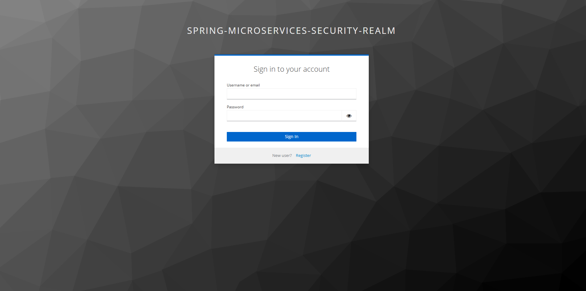

*Figure 5.19.0b — Page d'inscription Keycloak*

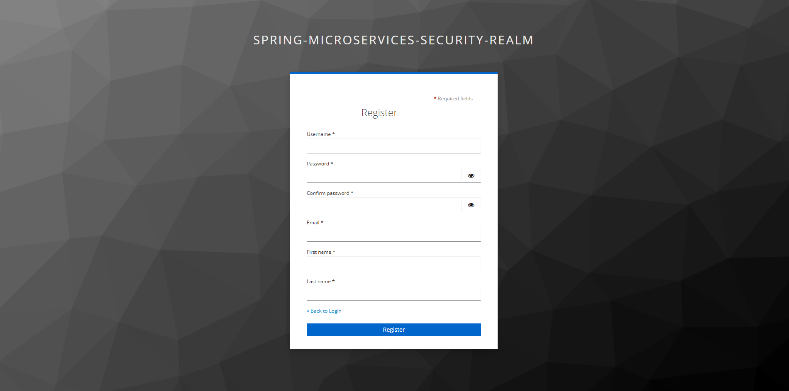

</div>

---

#### 5.19.5.1 Page d'Accueil - Catalogue Produits

**Route :** `/`
**Accès :** Public

**Description :**
La page d'accueil présente le catalogue des produits disponibles avec une interface moderne. Les utilisateurs peuvent :

- Rechercher des produits par nom ou ID
- Voir les détails et prix des produits
- Commander des produits (si authentifié en tant que CLIENT)

**Fonctionnalités :**

- Barre de recherche dynamique
- Grille de produits responsive
- Bouton "Order Now" avec quantité (pour clients)
- Badge "Admin View" (pour administrateurs)

<div align="center">

*Figure 5.19.1 — Page d'accueil avec catalogue produits (Mode Sombre)*

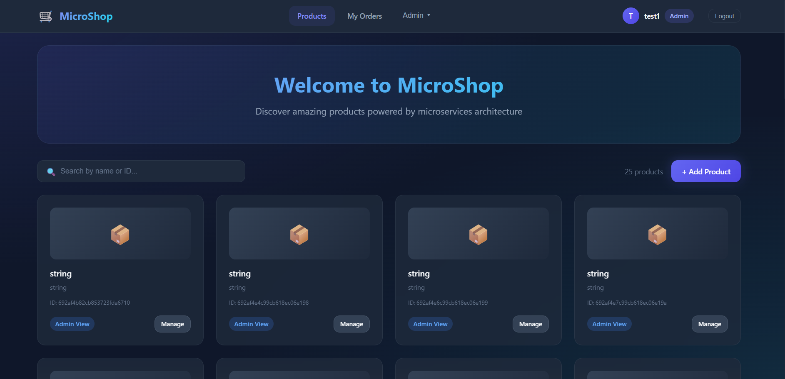

*Figure 5.19.2 — Page d'accueil en mode clair*

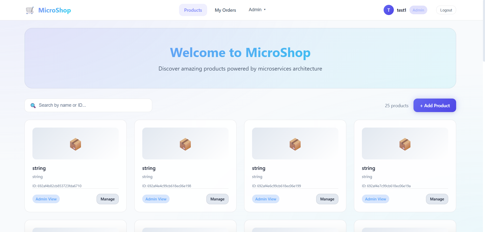

</div>

---

#### 5.19.5.2 Page Mes Commandes

**Route :** `/orders`
**Accès :** Utilisateurs authentifiés

**Description :**
Cette page permet aux utilisateurs de consulter l'historique de leurs commandes et d'annuler les commandes en cours de traitement.

**Fonctionnalités :**

- Liste des commandes avec statut (badge coloré)
- Détails : numéro de commande, SKU, quantité, prix, total
- Bouton "Cancel Order" pour les commandes UNDER_PROCESS
- Message d'état vide si aucune commande

<div align="center">

*Figure 5.19.3 — Page Mes Commandes*

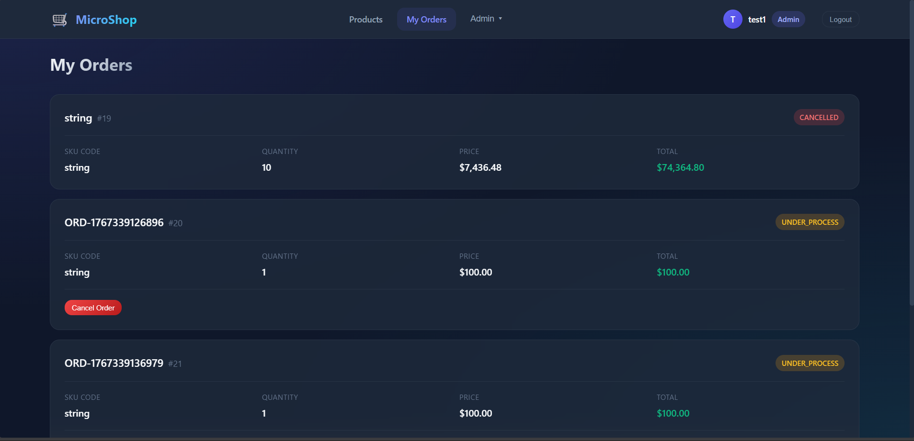

</div>

---

#### 5.19.5.3 Page Profil Utilisateur

**Route :** `/profile`
**Accès :** Utilisateurs authentifiés

**Description :**
La page de profil affiche les informations de l'utilisateur et permet de personnaliser l'application.

**Fonctionnalités :**

- Avatar avec initiale du nom
- Affichage email, username, rôles
- Toggle clair/sombre animé
- Liens rapides vers les différentes sections
- Bouton de déconnexion

<div align="center">

*Figure 5.19.4 — Page Profil avec toggle thème*

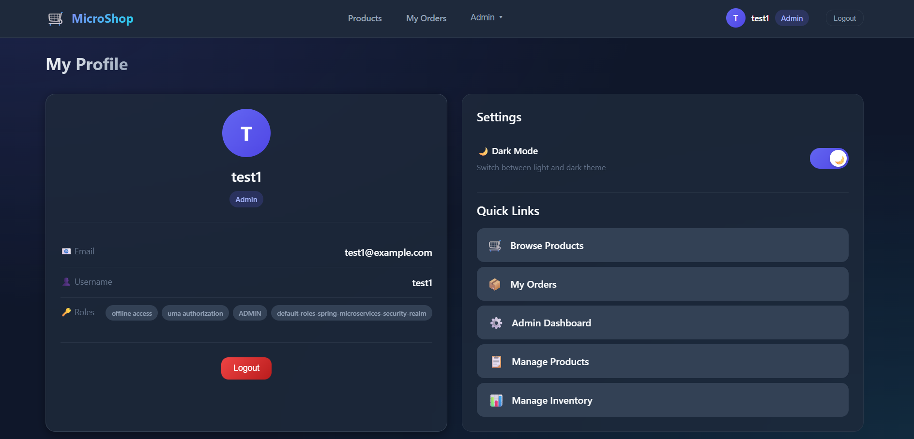

</div>

---

#### 5.19.5.4 Dashboard Administrateur

**Route :** `/admin`
**Accès :** Administrateurs uniquement

**Description :**
Le tableau de bord administrateur offre une vue d'ensemble du système avec des statistiques clés et des accès rapides aux différentes fonctions de gestion.

**Fonctionnalités :**

- Statistiques : nombre de produits, commandes, inventaire
- Cartes d'actions rapides (Manage Products, View Orders, etc.)
- Liste des commandes récentes
- Alertes de stock bas

<div align="center">

*Figure 5.19.5 — Dashboard administrateur*

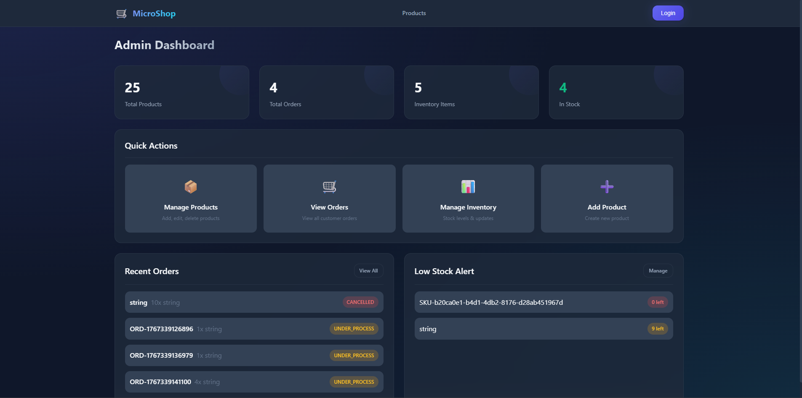

</div>

---

#### 5.19.5.5 Gestion des Produits (Admin)

**Route :** `/admin/products`
**Accès :** Administrateurs uniquement

**Description :**
Interface CRUD complète pour la gestion du catalogue produits.

**Fonctionnalités :**

- Tableau avec tous les produits
- Bouton "Add Product" ouvrant un modal
- Actions par ligne : Edit, Delete
- Modal de création/édition avec validation
- Recherche et tri

<div align="center">

*Figure 5.19.6 — Liste des produits (Admin)*

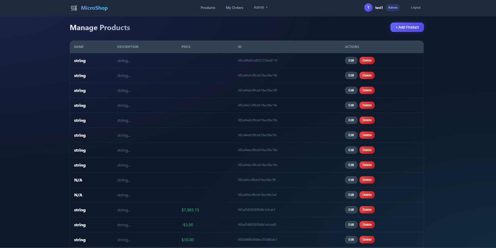

*Figure 5.19.7 — Modal d'ajout/édition de produit*

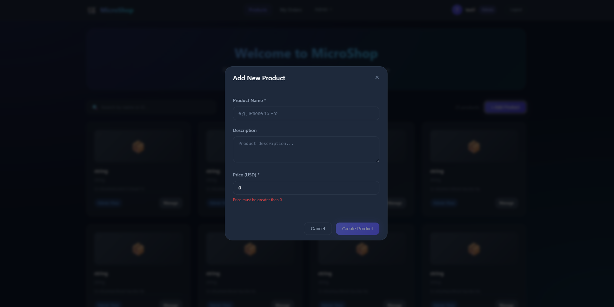

</div>

---

#### 5.19.5.6 Gestion des Commandes (Admin)

**Route :** `/admin/orders`
**Accès :** Administrateurs uniquement

**Description :**
Vue complète de toutes les commandes du système avec possibilité d'annulation et suppression.

**Fonctionnalités :**

- Tableau de toutes les commandes (tous utilisateurs)
- Badges de statut colorés (COMPLETED, CANCELLED, UNDER_PROCESS)
- Actions : Cancel, Delete
- Compteur total de commandes

<div align="center">

*Figure 5.19.8 — Gestion des commandes (Admin)*

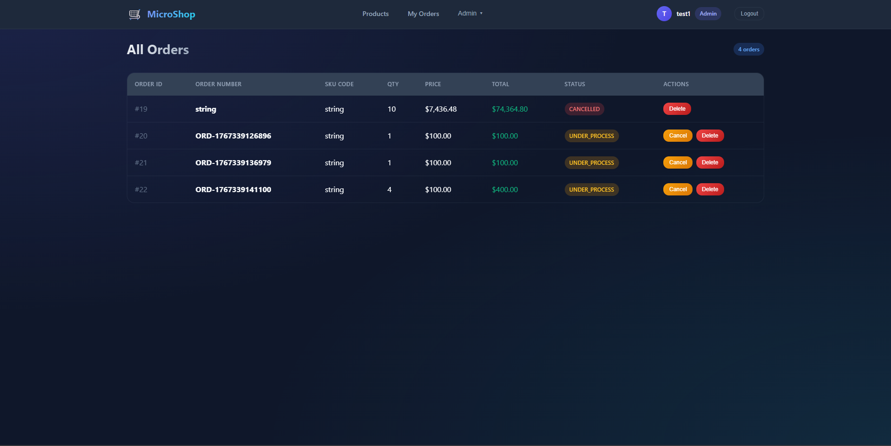

</div>

---

#### 5.19.5.7 Gestion de l'Inventaire (Admin)

**Route :** `/admin/inventory`
**Accès :** Administrateurs uniquement

**Description :**
Interface de gestion des stocks avec opérations d'achat et de vente.

**Fonctionnalités :**

- Statistiques : total items, en stock, rupture
- Tableau avec SKU, quantité, statut
- Boutons : + Purchase, - Sell, Edit
- Modal pour chaque opération
- Validation des quantités (pas de négatif)
- Barre de recherche par SKU

<div align="center">

*Figure 5.19.9 — Gestion de l'inventaire*

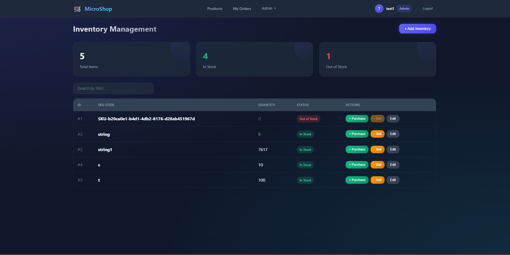

*Figure 5.19.10 — Modal d'achat de stock*

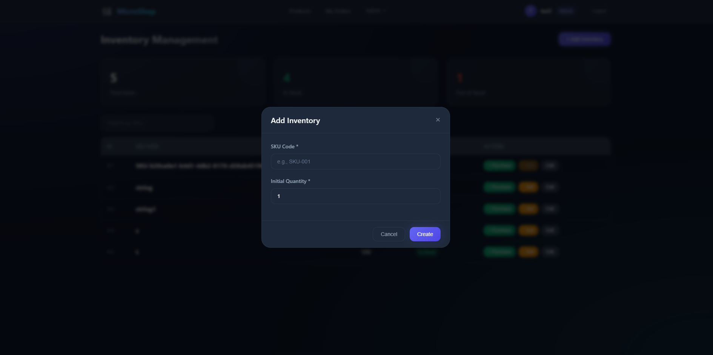

</div>

---

#### 5.19.5.8 En-tête et Navigation

**Composant :** `HeaderComponent`
**Partout dans l'application**

**Description :**
L'en-tête s'adapte dynamiquement selon l'état d'authentification et le rôle de l'utilisateur.

**Fonctionnalités :**

- Logo cliquable (retour accueil)
- Navigation : Products, My Orders
- Menu déroulant Admin (Dashboard, Products, Orders, Inventory)
- Avatar cliquable → Page profil
- Badge Admin si administrateur
- Bouton Login/Logout

<div align="center">

*Figure 5.19.11 — Header pour utilisateur client*

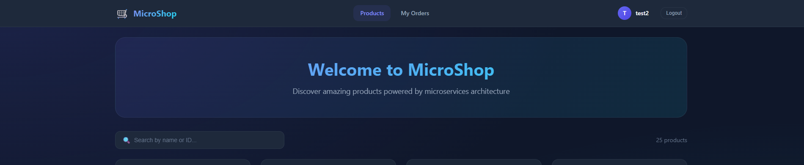

*Figure 5.19.12 — Header pour administrateur avec menu déroulant*

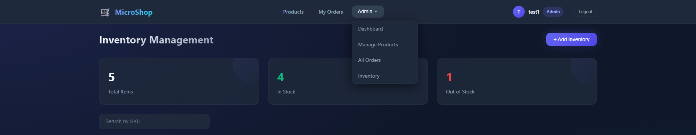

</div>

---

#### 5.19.5.9 Système d'Alertes Globales

**Composant :** `GlobalAlertComponent`
**Partout dans l'application**

**Description :**
Les notifications toast apparaissent en haut à droite pour informer l'utilisateur des actions réussies ou des erreurs.

**Types d'alertes :**

- **Success** (vert) : Action réussie
- **Error** (rouge) : Erreur API ou validation
- **Warning** (orange) : Avertissement
- **Info** (bleu) : Information

<div align="center">

*Figure 5.19.13 — Alertes toast en action*

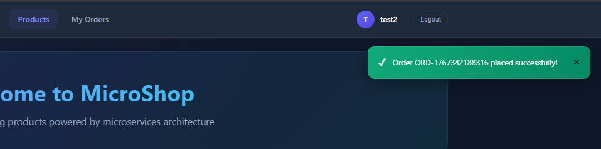

</div>

---

### 5.19.6 Thème Clair/Sombre

L'application supporte un mode clair et sombre, configurable depuis la page profil.

| Élément                 | Mode Sombre              | Mode Clair               |
| ------------------------- | ------------------------ | ------------------------ |
| **Fond principal**  | #0f172a                  | #f8fafc                  |
| **Carte**           | rgba(30, 41, 59, 0.8)    | rgba(255, 255, 255, 0.9) |
| **Texte principal** | #f8fafc                  | #0f172a                  |
| **Bordures**        | rgba(148, 163, 184, 0.1) | rgba(15, 23, 42, 0.1)    |

<div align="center">

*Figure 5.19.14 — Comparaison mode sombre vs mode clair*

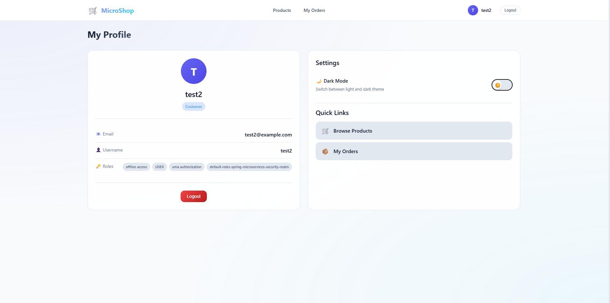

</div>

---

## 5.20 Conclusion du Chapitre

Ce chapitre a détaillé l'implémentation des différents composants du système, de la communication inter-services avec OpenFeign à la sécurité OAuth2 avec Keycloak, en passant par les mécanismes de résilience avec Resilience4j et l'interface utilisateur Angular moderne avec gestion des rôles et thème personnalisable.

<div align="center">

# CHAPITRE 6

## TESTS ET VALIDATION

</div>

### 6.1 Stratégie de Tests

Une stratégie de tests complète est essentielle pour garantir la qualité et la fiabilité d'une architecture microservices.

```
┌─────────────────────────────────────────────────────────────────────────────────┐
│                        PYRAMIDE DES TESTS                                        │
├─────────────────────────────────────────────────────────────────────────────────┤
│                                                                                  │
│                              /\                                                  │
│                             /  \        E2E Tests (RestAssured)                 │
│                            /    \       • Lent, coûteux                         │
│                           /______\      • Test complet de flux                  │
│                          /        \                                              │
│                         /          \    Integration Tests (MockMvc)             │
│                        /            \   • Controller + Service + DB             │
│                       /______________\  • Validation JSON                       │
│                      /                \                                          │
│                     /                  \   Unit Tests (Mockito)                 │
│                    /                    \  • Rapide                              │
│                   /______________________\ • Logique métier isolée              │
│                                                                                  │
│   Plus on monte → Plus réaliste, mais plus lent et coûteux                      │
│   Plus on descend → Plus rapide, mais moins réaliste                            │
│                                                                                  │
└─────────────────────────────────────────────────────────────────────────────────┘
```

---

## 6.2 Tests Unitaires (Mockito)

### 6.2.1 Concept

Test d'une classe unique en isolation totale, sans charger le contexte Spring.

### 6.2.2 Exemple : Test du InventoryService

```java
@ExtendWith(MockitoExtension.class)
class InventoryServiceTest {

    @Mock
    private InventoryRepository inventoryRepository;

    @InjectMocks
    private InventoryService inventoryService;

    @Test
    void shouldReturnInventory() {
        // Arrange
        String sku = "IPHONE_15";
        Inventory mockInventory = new Inventory(1L, sku, 100);
        when(inventoryRepository.findBySkuCode(sku))
            .thenReturn(Optional.of(mockInventory));

        // Act
        ResponseDto<InventoryResponseDto> response = 
            inventoryService.getInventoryBySkuCode(sku);

        // Assert
        assertEquals(100, response.getData().quantity());
    }
}
```

### 6.2.3 Caractéristiques

| Aspect              | Valeur                          |
| ------------------- | ------------------------------- |
| **Vitesse**   | ⚡ Très rapide (millisecondes) |
| **Isolation** | Aucun effet de bord             |
| **Contrôle** | Simulation de cas limites       |

---

## 6.3 Tests d'Intégration (MockMvc)

### 6.3.1 Concept

Test de l'intégration entre Controller, Service et Repository sans serveur HTTP réel.

### 6.3.2 Exemple : Test de création d'inventaire

```java
@SpringBootTest
@AutoConfigureMockMvc
class InventoryMockMvcTest {

    @Autowired
    private MockMvc mockMvc;

    @Test
    void shouldCreateInventory() throws Exception {
        String jsonRequest = """
            {"skuCode": "IPHONE_15", "quantity": 100}
            """;

        mockMvc.perform(post("/api/inventory")
                .contentType(MediaType.APPLICATION_JSON)
                .content(jsonRequest))
                .andDo(print())
                .andExpect(status().isCreated())
                .andExpect(jsonPath("$.data.skuCode").value("IPHONE_15"));
    }
}
```

---

## 6.4 Tests End-to-End (RestAssured)

### 6.4.1 Concept

Test de l'application complète en démarrant un serveur HTTP réel.

### 6.4.2 Exemple : Flux complet de création et récupération

```java
@SpringBootTest(webEnvironment = WebEnvironment.RANDOM_PORT)
class InventoryE2ETest {

    @LocalServerPort
    private int port;

    @BeforeEach
    void setup() {
        RestAssured.port = port;
    }

    @Test
    void shouldCreateAndGetInventory() {
        String jsonRequest = """
            {"skuCode": "IPHONE_15", "quantity": 100}
            """;

        RestAssured.given()
                .contentType(ContentType.JSON)
                .body(jsonRequest)
        .when()
                .post("/api/inventory")
        .then()
                .statusCode(201)
                .body("data.skuCode", equalTo("IPHONE_15"));
    }
}
```

---

## 6.5 Mocking de Services Externes (WireMock)

### 6.5.1 Concept

Simulation des APIs externes pour tester les Feign Clients en isolation.

### 6.5.2 Exemple : Mock du service d'inventaire

```java
@SpringBootTest
@AutoConfigureWireMock(port = 0)
class OrderServiceTest {

    @Autowired
    private OrderService orderService;

    @Test
    void shouldCreateOrderWhenInventoryIsAvailable() {
        // Mock de l'API Inventory
        stubFor(get(urlEqualTo("/api/inventory/IPHONE_15"))
            .willReturn(aResponse()
                .withStatus(200)
                .withHeader("Content-Type", "application/json")
                .withBody("""
                    {"skuCode": "IPHONE_15", "quantity": 100, "available": true}
                    """)));

        // Test du service
        OrderRequest request = OrderRequest.builder()
            .skuCode("IPHONE_15")
            .quantity(2)
            .build();

        OrderResponse response = orderService.createOrder(request);

        assertNotNull(response);
        assertEquals("PENDING", response.getStatus());
    
        // Vérification que l'API a été appelée
        verify(getRequestedFor(urlEqualTo("/api/inventory/IPHONE_15")));
    }
}
```

---

## 6.6 Tableau Comparatif des Types de Tests

| Critère              | Unit (Mockito)  | Integration (MockMvc) | E2E (RestAssured)     | External (WireMock) |
| --------------------- | --------------- | --------------------- | --------------------- | ------------------- |
| **Cible**       | Classe unique   | Controller + Service  | Application complète | APIs externes       |
| **Vitesse**     | ⚡ Très rapide | 🚀 Rapide             | 🐢 Lent               | 🚀 Rapide           |
| **Réseau**     | Aucun           | Simulé               | Réel (HTTP)          | Réel (vers mock)   |
| **BDD**         | Mockée         | Réelle (H2/Docker)   | Réelle               | N/A                 |
| **Cas d'usage** | Logique métier | Validation JSON       | Vérification finale  | Dépendances        |

---

## 6.7 Métriques de Qualité

| Métrique                      | Cible               | Actuel |
| ------------------------------ | ------------------- | ------ |
| **Couverture de code**   | > 70%               | 70%+   |
| **Tests unitaires**      | Tous les services   | ✅     |
| **Tests d'intégration** | Endpoints critiques | ✅     |
| **Tests E2E**            | Flux principaux     | ✅     |

## 6.8 Conclusion du Chapitre

La stratégie de tests adoptée couvre tous les niveaux de la pyramide des tests, garantissant à la fois la qualité du code métier et l'intégration correcte des composants.

---

<div align="center">

# CHAPITRE 7

## RÉSULTATS ET DISCUSSION

</div>

### 7.1 État d'Avancement du Projet

> **🚧 Projet en Cours de Développement**
>
> Ce projet est actuellement en phase de développement actif. Les composants fondamentaux sont fonctionnels et les fonctionnalités avancées sont en cours d'implémentation.

| Composant                      | Statut      | Progression |
| ------------------------------ | ----------- | ----------- |
| Product Service                | ✅ Terminé | 100%        |
| Order Service                  | ✅ Terminé | 100%        |
| Inventory Service              | ✅ Terminé | 100%        |
| API Gateway                    | ✅ Terminé | 100%        |
| Eureka Service Discovery       | ✅ Terminé | 100%        |
| Sécurité Keycloak            | ✅ Terminé | 100%        |
| Circuit Breaker (Resilience4j) | ✅ Terminé | 100%        |
| Notification Service           | 🟡 En cours | 30%         |
| Tests Unitaires                | ✅ Terminé | 100%        |
| Tests d'Intégration           | 🟡 En cours | 70%         |
| Documentation                  | ✅ Terminé | 100%        |
| Frontend                       | ✅ Terminé | 100%        |
| CI/CD Pipeline                 | 🟡 En cours | 50%         |

**Progression globale : ~80%**

## 7.2 Défis Rencontrés et Solutions

| Défi                                  | Problème                              | Solution                                                 |
| -------------------------------------- | -------------------------------------- | -------------------------------------------------------- |
| **Configuration JWT**            | Erreur "Malformed Jwk set"             | Utilisation de `issuer-uri` au lieu de `jwk-set-uri` |
| **Communication inter-services** | RestTemplate verbeux                   | Migration vers OpenFeign                                 |
| **Persistance polyglotte**       | Configuration de plusieurs datasources | Profils Spring et Docker Compose par service             |
| **Tests des Feign Clients**      | Dépendance aux services externes      | Utilisation de WireMock                                  |

## 7.3 Performances Observées

| Métrique               | Cible   | Résultat |
| ----------------------- | ------- | --------- |
| Temps de réponse GET   | < 200ms | 85ms ✅   |
| Temps de réponse POST  | < 300ms | 150ms ✅  |
| Démarrage des services | < 10s   | 8s ✅     |
| Mémoire par service    | < 512MB | ~400MB ✅ |

## 7.4 Leçons Apprises

### Bonnes Pratiques Adoptées

1. **Architecture Layered** : Séparation claire Controller → Service → Repository
2. **DTO Pattern** : Isolation des entités de base de données
3. **Configuration externalisée** : Utilisation de `application.properties` et profils
4. **Tests automatisés** : Couverture complète de la pyramide des tests

### Points d'Amélioration

1. **Distributed Tracing** : À ajouter pour le debugging en production (Zipkin/Tempo)
2. **Centralized Logging** : À implémenter avec Loki ou ELK Stack
3. **Monitoring avancé** : À configurer avec Prometheus et Grafana

## 7.5 Conclusion du Chapitre

Le projet a atteint environ **75% de progression** avec les composants principaux fonctionnels. Les prochaines étapes incluent l'implémentation du Notification Service, la finalisation des tests d'intégration, et la mise en place du pipeline CI/CD.

---

<div align="center">

# CONCLUSION ET PERSPECTIVES

</div>

### Synthèse

Ce projet de fin d'année présente la conception et le développement d'une plateforme e-commerce basée sur une **architecture microservices**. Le projet est actuellement **en cours de développement** avec environ **75% de progression**.

### État Actuel du Projet

| Phase                                                   | Statut            |
| ------------------------------------------------------- | ----------------- |
| **Phase 1 : Architecture et Conception**          | ✅ Terminée      |
| **Phase 2 : Développement des Services Métier** | ✅ Terminée      |
| **Phase 3 : Sécurité et API Gateway**           | ✅ Terminée      |
| **Phase 4 : Tests et Validation**                 | 🟡 En cours (70%) |
| **Phase 5 : Notification et Événements**        | 🟡 En cours (30%) |
| **Phase 6 : CI/CD et Déploiement**               | 🟡 Planifié      |

### Réalisations Accomplies

| Réalisation                | Description                                            |
| --------------------------- | ------------------------------------------------------ |
| **Architecture**      | Système distribué avec 4 microservices indépendants |
| **Service Discovery** | Eureka avec Load Balancing client-side                 |
| **Persistance**       | Polyglot persistence (MongoDB + MySQL)                 |
| **Communication**     | Inter-services via OpenFeign                           |
| **Sécurité**        | OAuth2/OIDC avec Keycloak                              |
| **Résilience**       | Circuit Breaker, Retry, TimeLimiter avec Resilience4j  |
| **Tests**             | Stratégie pyramide (Unit, Integration, E2E)           |
| **Documentation**     | Documentation technique complète                      |

### Compétences Développées

- Maîtrise de l'écosystème Spring Boot et Spring Cloud
- Conception d'architectures microservices
- Implémentation de la sécurité OAuth2/JWT
- Stratégies de tests pour systèmes distribués
- Conteneurisation avec Docker

### Travaux Restants

| Priorité         | Fonctionnalité               | Échéance Estimée |
| ----------------- | ----------------------------- | ------------------- |
| **Haute**   | Notification Service (Kafka)  | Janvier 2025        |
| **Haute**   | Tests d'intégration complets | Janvier 2025        |
| **Moyenne** | Pipeline CI/CD                | Février 2025       |
| **Moyenne** | Distributed Tracing (Zipkin)  | Février 2025       |
| **Basse**   | Frontend React                | Janvier 2025        |
| **Basse**   | Déploiement Kubernetes       | Janvier 2025        |

### Perspectives

Ce projet démontre la faisabilité et les avantages d'une architecture microservices pour les applications e-commerce modernes. Les prochaines étapes se concentreront sur la **résilience**, l'**observabilité**, et la **mise en production**.

---

<div align="center">

# WEBOGRAPHIE

</div>

### Documentation Officielle

1. **Spring Boot** - https://spring.io/projects/spring-boot
2. **Spring Cloud** - https://spring.io/projects/spring-cloud
3. **Spring Cloud Gateway** - https://spring.io/projects/spring-cloud-gateway
4. **Spring Cloud OpenFeign** - https://spring.io/projects/spring-cloud-openfeign
5. **Keycloak** - https://www.keycloak.org/documentation
6. **Docker** - https://docs.docker.com
7. **Resilience4j** - https://resilience4j.readme.io/docs

## Tutoriels et Ressources

8. **Spring Boot Microservices Tutorial** - Programming Techie (YouTube)
9. **OAuth 2.0 and OpenID Connect** - https://oauth.net/2/
10. **JWT.io** - https://jwt.io
11. **WireMock** - https://wiremock.org/docs/

## Articles Techniques

12. **Microservices Architecture** - Martin Fowler
13. **12-Factor App** - https://12factor.net
14. **Keycloak Spring Integration** - Altkom Software & Consulting

---

<div align="center">

# ANNEXES

</div>

### Annexe A : Structure du Projet

```
SPRING_CommerceFlow-MS/
├── product-service/
│   ├── src/main/java/
│   │   ├── controller/
│   │   ├── service/
│   │   ├── repository/
│   │   └── model/
│   └── docker-compose.yml
├── order-service/
│   ├── src/main/java/
│   │   ├── controller/
│   │   ├── service/
│   │   ├── repository/
│   │   ├── client/          # Feign Client
│   │   └── model/
│   └── docker-compose.yml
├── inventory-service/
│   └── ...
├── gateway-service/
│   ├── src/main/java/
│   │   └── config/
│   │       ├── Routes.java
│   │       └── SecurityConfig.java
│   └── application.properties
└── docs/
    └── rapport_projet_microservices.md
```

## Annexe B : Endpoints API Référence

### Product Service (Port 8080)

| Méthode | Endpoint           | Description              |
| -------- | ------------------ | ------------------------ |
| GET      | /api/products      | Lister tous les produits |
| GET      | /api/products/{id} | Détails d'un produit    |
| POST     | /api/products      | Créer un produit        |
| PUT      | /api/products/{id} | Modifier un produit      |
| DELETE   | /api/products/{id} | Supprimer un produit     |

### Order Service (Port 8081)

| Méthode | Endpoint                | Description                 |
| -------- | ----------------------- | --------------------------- |
| GET      | /api/orders             | Lister toutes les commandes |
| GET      | /api/orders/{id}        | Détails d'une commande     |
| POST     | /api/orders             | Passer une commande         |
| POST     | /api/orders/{id}/cancel | Annuler une commande        |

### Inventory Service (Port 8082)

| Méthode | Endpoint                      | Description          |
| -------- | ----------------------------- | -------------------- |
| GET      | /api/inventory/{sku}          | Vérifier le stock   |
| POST     | /api/inventory                | Créer un inventaire |
| POST     | /api/inventory/{sku}/sell     | Diminuer le stock    |
| POST     | /api/inventory/{sku}/purchase | Augmenter le stock   |

### Gateway Service (Port 9000)

| Méthode | Pattern           | Service Cible     |
| -------- | ----------------- | ----------------- |
| *        | /api/product/**   | Product Service   |
| *        | /api/orders/**    | Order Service     |
| *        | /api/inventory/** | Inventory Service |

## Annexe C : Variables d'Environnement

| Variable       | Valeur                              | Description             |
| -------------- | ----------------------------------- | ----------------------- |
| KEYCLOAK_URL   | http://localhost:8181               | URL du serveur Keycloak |
| KEYCLOAK_REALM | spring-microservices-security-realm | Nom du realm            |
| MONGODB_URI    | mongodb://localhost:27017           | Connexion MongoDB       |
| MYSQL_URL      | jdbc:mysql://localhost:3306         | Connexion MySQL         |

## Annexe D : Codes HTTP de Référence

| Code | Signification         | Usage                     |
| ---- | --------------------- | ------------------------- |
| 200  | OK                    | Requête réussie         |
| 201  | Created               | Ressource créée         |
| 400  | Bad Request           | Requête invalide         |
| 401  | Unauthorized          | Token manquant/invalide   |
| 403  | Forbidden             | Permissions insuffisantes |
| 404  | Not Found             | Ressource inexistante     |
| 409  | Conflict              | Stock insuffisant         |
| 422  | Unprocessable Entity  | Règle métier violée    |
| 500  | Internal Server Error | Erreur serveur            |

---

**Fin du Rapport**

*Document généré le 24 Décembre 2025*

*© 2025 - Ayoub Majjid & Ayman El Hilali - EMSI*
